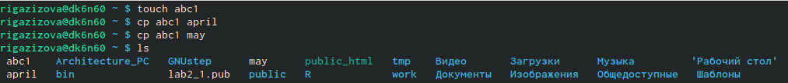
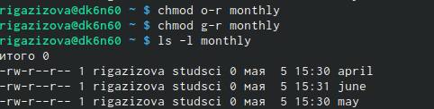
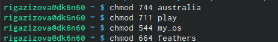
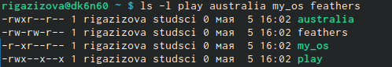
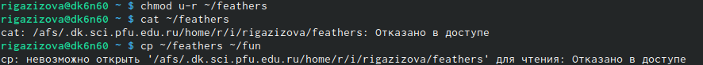
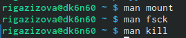

---
## Front matter
lang: ru-RU
title:  Презентация по 5 лабораторной работе
author: |
	
	Газизова Регина \inst{1}
institute: |
	\inst{1}RUDN University, Moscow, Russian Federation
	
date: 5 мая, Москва, Россия

## Formatting
toc: false
slide_level: 2
theme: metropolis
header-includes: 
 - \metroset{progressbar=frametitle,sectionpage=progressbar,numbering=fraction}
 - '\makeatletter'
 - '\beamer@ignorenonframefalse'
 - '\makeatother'
aspectratio: 43
section-titles: true
---

# Лаборатораная работа № 5

## Выполняем примеры 

- Создаем/копируем/переименовывем/перемещаем файлы и каталоги. (рис. [-@fig:001], [-@fig:002]) 
 
 { #fig:001 width=70% }
 
 { #fig:002 width=70% }
 
 

## Права доступа

- Лишаем/даруем различные права владельца, группы и остальных.(рис. [-@fig:008], [-@fig:017], [-@fig:018]) 
  
  { #fig:008 width=70% } 
    
  { #fig:017 width=70% }
  
  { #fig:018 width=70% } 
  

## Проверяем можно ли без прав что-либо делать

- Лишили прав на чтение: (рис. [-@fig:020]) 
  
  { #fig:020 width=70% }

## Значение команд

- Посмотрели, для чего служат некоторые команды с помощью man (рис. [-@fig:022]) 
  
  { #fig:022 width=70% }
 

## {.standout}

Это было кратное описание проделанной лабораторной работы.
