---
## Front matter
title: "Отчет по Лабораторной работе №5"
subtitle: "Дисциплина - Операционные системы"
author: "Газизова Регина"

## Generic otions
lang: ru-RU
toc-title: "Содержание"

## Bibliography
bibliography: bib/cite.bib
csl: pandoc/csl/gost-r-7-0-5-2008-numeric.csl

## Pdf output format
toc: true # Table of contents
toc-depth: 2
lof: true # List of figures
lot: true # List of tables
fontsize: 12pt
linestretch: 1.5
papersize: a4
documentclass: scrreprt
## I18n polyglossia
polyglossia-lang:
  name: russian
  options:
	- spelling=modern
	- babelshorthands=true
polyglossia-otherlangs:
  name: english
## I18n babel
babel-lang: russian
babel-otherlangs: english
## Fonts
mainfont: PT Serif
romanfont: PT Serif
sansfont: PT Sans
monofont: PT Mono
mainfontoptions: Ligatures=TeX
romanfontoptions: Ligatures=TeX
sansfontoptions: Ligatures=TeX,Scale=MatchLowercase
monofontoptions: Scale=MatchLowercase,Scale=0.9
## Biblatex
biblatex: true
biblio-style: "gost-numeric"
biblatexoptions:
  - parentracker=true
  - backend=biber
  - hyperref=auto
  - language=auto
  - autolang=other*
  - citestyle=gost-numeric
## Pandoc-crossref LaTeX customization
figureTitle: "Рис."
tableTitle: "Таблица"
listingTitle: "Листинг"
lofTitle: "Список иллюстраций"
lotTitle: "Список таблиц"
lolTitle: "Листинги"
## Misc options
indent: true
header-includes:
  - \usepackage{indentfirst}
  - \usepackage{float} # keep figures where there are in the text
  - \floatplacement{figure}{H} # keep figures where there are in the text
---

# Цель работы

Ознакомление с файловой системой Linux, её структурой, именами и содержаниемкаталогов. Приобретение практических навыков по применению команд для работыс файлами и каталогами,по управлению процессами (и работами),по проверке исполь-зования диска и обслуживанию файловой системы.

# Задание

- Выполнитевсепримеры,приведённыевпервойчастиописаниялабораторнойработы.
- Выполните следующие действия, зафиксировав в отчёте по лабораторной работеиспользуемые при этом команды и результаты их выполнения:
  - Скопируйте файл/usr/include/sys/io.hв домашний каталоги назовите егоequipment.Если файлаio.hнет,то используйтелюбойдругой файл в каталоге/usr/include/sys/вместо него.
  - В домашнем каталоге создайте директорию~/ski.plases.
  - Переместите файлequipmentв каталог~/ski.plases.
  - Переименуйте файл~/ski.plases/equipmentв~/ski.plases/equiplist.
  - Создайте в домашнем каталоге файлabc1и скопируйте его в каталог~/ski.plases,назовите егоequiplist2.
  - Создайте каталог с именемequipmentв каталоге~/ski.plases. 
  - Переместите файлы~/ski.plases/equiplistиequiplist2в каталог~/ski.plases/equipment.
  - Создайте и переместите каталог~/newdirв каталог~/ski.plasesи назовите его plans.
- Определите опции командыchmod,необходимые длятого,чтобы присвоить перечис-ленным ниже файлам выделенные права доступа, считая, что в начале таких правнет:
  - drwxr--r--   ...   australia 
  - drwx--x--x   ...   play
  - -r-xr--r--   ...   my_os
  - -rw-rw-r--   ...   feathers 
- При необходимости создайте нужные файлы.
- Проделайте приведённые ниже упражнения, записывая в отчёт по лабораторнойработе используемые при этом команды:
  - Просмотрите содержимое файла/etc/password.
  - Скопируйте файл~/feathersв файл~/file.old.
  - Переместите файл~/file.oldв каталог~/play.
  - Скопируйте каталог~/playв каталог~/fun.
  - Переместите каталог~/funв каталог~/playи назовите егоgames.
  - Лишите владельца файла~/feathersправа на чтение.
  - Что произойдёт,если вы попытаетесь просмотреть файл~/feathersкомандойcat?
  - Что произойдёт,если вы попытаетесь скопировать файл~/feathers?
  - Дайте владельцу файла~/feathersправо на чтение.
  - Лишите владельца каталога~/playправа на выполнение.
  - Перейдите в каталог~/play.Что произошло?
  - Дайте владельцу каталога~/playправо на выполнение.
- Прочитайтеmanпо командамmount,fsck,mkfs,killи кратко их охарактеризуйте,приведя примеры.
# Теоретическое введение

- Для созданиятекстового файла можно использовать команду touch
- Для просмотра файлов небольшого размера можно использовать командуcat.
- Команда cp используется для копирования файлов и каталогов.
- Команды mv и mvdir предназначены для перемещения и переименования файлови каталогов.
- Права доступа к файлу или каталогу можно изменить,воспользовавшись командой chmod.

# Выполнение лабораторной работы

 Создаем файл abc1 и копируем его в файлы april и may с помощью команды cp (рис. [-@fig:001])
 
 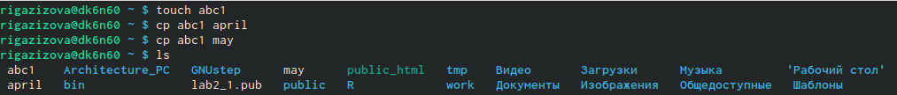{ #fig:001 width=70% }
 
 Создаем каталог monthly и копируем в него файлы april и may.(рис. [-@fig:002]) 
 
 { #fig:002 width=70% }
 
 Переименовываем файл may в файл june с помощью той же команды cp.(рис. [-@fig:003]) 
 
 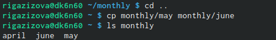{ #fig:003 width=70% }
 
 Создаем новый каталог и и перемещаем в него в уже существующий. (рис. [-@fig:004]) 
 
  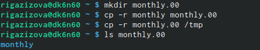{ #fig:004 width=70% }
  
  Переместили файл july в каталог monthly.00 (рис. [-@fig:005]) 
  
  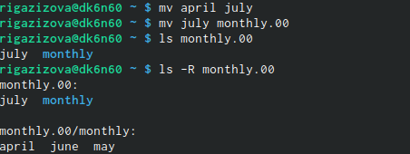{ #fig:005 width=70% }
  
  Переименовали каталог monthly.00 в monthly.01. Переместили каталог monthly.01 в каталог reports. Переименовали каталог reports/monthly.01 в reports/monthly (рис. [-@fig:006]) 
  
  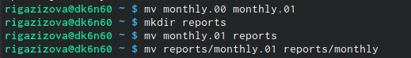{ #fig:006 width=70% }
  
  Создали файл~/may с правом выполнения для владельца. Лишили владельца файла~/may права на выполнение (рис. [-@fig:007]) 
  
  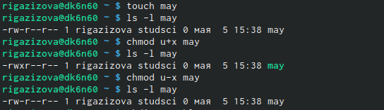{ #fig:007 width=70% }
  
  Создали каталог monthly с запретом на чтение для членов группы и всехостальных пользователей (рис. [-@fig:008]) 
  
  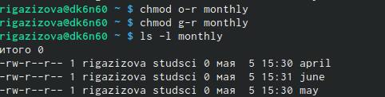{ #fig:008 width=70% }
  
  Создали файл ~/abc1 с правом записи для членов группы (рис. [-@fig:009]) 
  
  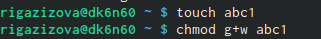{ #fig:009 width=70% }
  
  Скопировали файл/usr/include/sys/io.h в домашний каталог и назовали его equipment. (рис. [-@fig:010]) 
  
  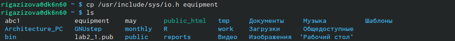{ #fig:010 width=70% }
  
  В домашнем каталоге создали директорию ~/ski.plases (рис. [-@fig:011]) 
  
  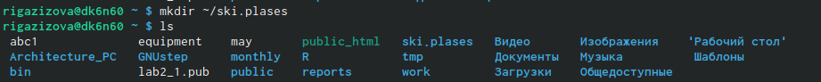{ #fig:011 width=70% }
  
  Переместили файл equipment в каталог ~/ski.plases.Переименовали файл ~/ski.plases/equipment в ~/ski.plases/equiplist (рис. [-@fig:012]) 
  
  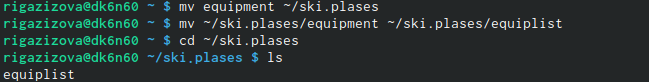{ #fig:012 width=70% }
  
  Создали в домашнем каталоге файл abc1 и скопировали его в каталог~/ski.plases, назовали его equiplist2. (рис. [-@fig:013]) 
  
  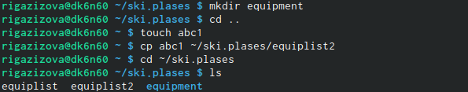{ #fig:013 width=70% }
  
  Переместили файлы ~/ski.plases/equiplist и equiplist2 в каталог ~/ski.plases/equipment. (рис. [-@fig:014]) 
  
  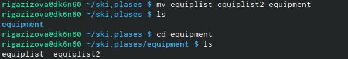{ #fig:014 width=70% }
  
  Создали и переместили каталог~/newdir в каталог~/ski.plases и назовали его plans (рис. [-@fig:015]) 
  
  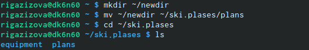{ #fig:015 width=70% }
  
  Создали нужные файлы - australia, play, my_os, feathers.Определили опции команды chmod,необходимые для того,чтобы присвоить перечисленным ниже файлам выделенные права доступа, считая, что в начале таких правнет (744, 711, 544, 664) (рис. [-@fig:016], [-@fig:017]😄️, [-@fig:018]) 
  
  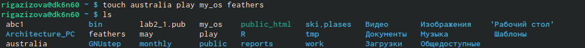{ #fig:016 width=70% }
  
  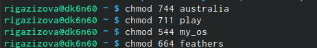{ #fig:017 width=70% }
  
  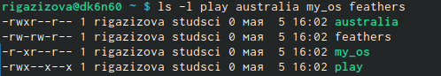{ #fig:018 width=70% }
  
  Скопировали файл~/feathers в файл ~/file.old. Переместили файл ~/file.old в каталог ~/play. Скопировали каталог ~/play в каталог ~/fun. (рис. [-@fig:019]) 
 
  { #fig:019 width=70% }
  
  Лишили владельца файла ~/feathers права на чтение. Попытались просмотреть файл~/feathers командой cat - не получилось (отказано в доступе). Попытались скопировать файл~/feathers - тоже не вышло. (рис. [-@fig:020]) 
  
  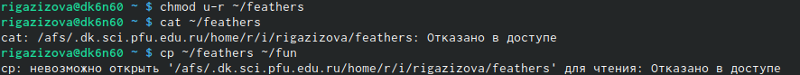{ #fig:020 width=70% }
  
  Лишили владельца каталога ~/play всех прав. Перешли в каталог~/play. Проблем не возникло. (рис. [-@fig:021]) 
  
  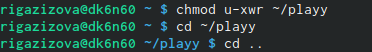{ #fig:021 width=70% }
  
  Прочитали man по командам mount - служит для подключения файловых систем разных устройств к этому большому дереву, fsck - используется для проверки и произвольного восстановления одной или более файловых систем, mkfs - используется для создания файловой системы Linux на некотором устройстве, kill - может быть использован для посылки какого-либо сигнала какому-либо процессу или группе процесса. (рис. [-@fig:022]) 
  
  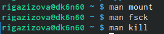{ #fig:022 width=70% }
  

# Выводы

Ознакомилась с файловой системой Linux, её структурой, именами и содержаниемкаталогов. Приобрела практических навыков по применению команд для работыс файлами и каталогами,по управлению процессами (и работами),по проверке использования диска и обслуживанию файловой системы.

