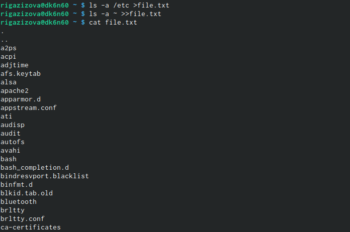
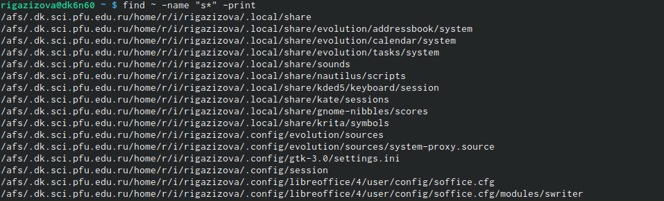
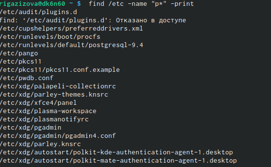
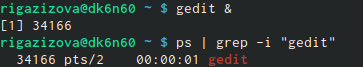
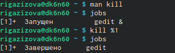
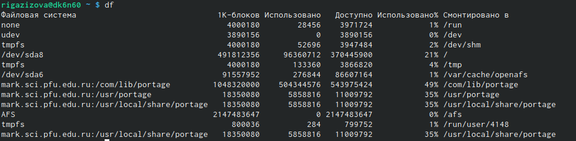
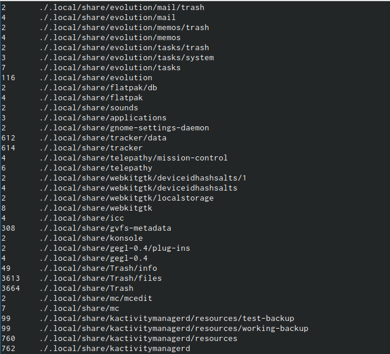

---
## Front matter
lang: ru-RU
title: Презентация по 6 лабораторной работе
author: |
	Газизова Реигна {1}
institute: |
	\inst{1}RUDN University, Moscow, Russian Federation

date: 6 Мая 2022, Москва, Россия

## Formatting
toc: false
slide_level: 2
theme: metropolis
header-includes: 
 - \metroset{progressbar=frametitle,sectionpage=progressbar,numbering=fraction}
 - '\makeatletter'
 - '\beamer@ignorenonframefalse'
 - '\makeatother'
aspectratio: 43
section-titles: true
---

# Презентация по 6 лабораторной
## Основные действия

- Записывали в файл названия файлов с определенным разрешением (рис. [-@fig:001])

{ #fig:001 width=70% }

## Буква с

- Выводили файлы, названные на определенную букву (рис. [-@fig:003], (рис. [-@fig:005])

{ #fig:003 width=70% }

{ #fig:005 width=70% }

## Фоновый режим

- Запускали программы в фоновом режиме (рис. [-@fig:009])

{ #fig:009 width=70% }

## Завершение

- Завершали программу с помощью команды (рис. [-@fig:010])

{ #fig:010 width=70% }

## DU DF

- Исполняли команды df and du (рис.  [-@fig:013], [-@fig:014])

{ #fig:013 width=70% }

{ #fig:014 width=70% }

## {.standout}
- Это было краткое описание наших действий в лабораторной работе 6.
