---
## Front matter
title: "Отчет по лабораторной работе № 6"
subtitle: "Дисциплина - операционные системы"
author: "Газизова Регина"

## Generic otions
lang: ru-RU
toc-title: "Содержание"

## Bibliography
bibliography: bib/cite.bib
csl: pandoc/csl/gost-r-7-0-5-2008-numeric.csl

## Pdf output format
toc: true # Table of contents
toc-depth: 2
lof: true # List of figures
lot: true # List of tables
fontsize: 12pt
linestretch: 1.5
papersize: a4
documentclass: scrreprt
## I18n polyglossia
polyglossia-lang:
  name: russian
  options:
	- spelling=modern
	- babelshorthands=true
polyglossia-otherlangs:
  name: english
## I18n babel
babel-lang: russian
babel-otherlangs: english
## Fonts
mainfont: PT Serif
romanfont: PT Serif
sansfont: PT Sans
monofont: PT Mono
mainfontoptions: Ligatures=TeX
romanfontoptions: Ligatures=TeX
sansfontoptions: Ligatures=TeX,Scale=MatchLowercase
monofontoptions: Scale=MatchLowercase,Scale=0.9
## Biblatex
biblatex: true
biblio-style: "gost-numeric"
biblatexoptions:
  - parentracker=true
  - backend=biber
  - hyperref=auto
  - language=auto
  - autolang=other*
  - citestyle=gost-numeric
## Pandoc-crossref LaTeX customization
figureTitle: "Рис."
tableTitle: "Таблица"
listingTitle: "Листинг"
lofTitle: "Список иллюстраций"
lotTitle: "Список таблиц"
lolTitle: "Листинги"
## Misc options
indent: true
header-includes:
  - \usepackage{indentfirst}
  - \usepackage{float} # keep figures where there are in the text
  - \floatplacement{figure}{H} # keep figures where there are in the text
---

# Цель работы

- Ознакомление с инструментами поиска файлов и фильтрации текстовых данных.Приобретение практических навыков: по управлению процессами (и заданиями), попроверке использования диска и обслуживанию файловых систем

# Задание
1. Осуществите вход в систему,используя соответствующее имя пользователя.
2. Запишите в файлfile.txtназвания файлов,содержащихся в каталоге/etc.Допи-шите в этот же файл названия файлов,содержащихся в вашем домашнем каталоге.
3. Выведите имена всех файлов изfile.txt,имеющих расширение.conf,после чегозапишите их в новыйтекстовой файлconf.txt.
4. Определите,какие файлы в вашем домашнем каталоге имеют имена,начинавшиесяс символаc? Предложите несколько вариантов,как это сделать.
5. Выведите на экран (по странично) имена файлов из каталога/etc,начинающиесяс символаh.
6. Запустите в фоновом режиме процесс,который будетзаписывать в файл~/logfileфайлы,имена которых начинаются сlog.
7. Удалите файл~/logfile.
8. Запустите из консолив фоновом режимередакторgedit.
9. Определитеидентификаторпроцессаgedit,используякомандуps,конвейерифильтрgrep.Как ещё можно определить идентификатор процесса?
10. Прочтите справку (man) командыkill, после чего используйте её для завершенияпроцессаgedit.
11. Выполните командыdfиdu,предварительно получив более подробную информациюоб этих командах,с помощью командыman.
12. Воспользовавшись справкой командыfind,выведите имена всех директорий,имею-щихся в вашем домашнем каталоге

# Теоретическое введение

- Командаfindиспользуется для поиска и отображения на экран имён файлов,соответ-ствующих заданной строке символов.
- Найти втекстовом файле указанную строку символов позволяет командаgrep.
- Командаdfпоказывает размер каждого смонтированного раздела диска.
- Командаduпоказывает число килобайт,используемое каждым файлом или каталогом.
- Любуювыполняющуюсявконсоликомандуиливнешнююпрограммуможнозапуститьв фоновом режиме.Для этого следует в конце имени команды указать знак амперсанда&.
- Запущенные фоном программы называются задачами (jobs).Ими можно управлятьс помощью командыjobs,которая выводит список запущенных в данный момент задач.
- Командаpsиспользуется для получения информации о процессах.

# Выполнение лабораторной работы

1. Осуществили вход в систему,используя соответствующее имя пользователя.
2. Записали в файл file.txt названия файлов,содержащихся в каталоге/etc. Дописали в этот же файл названия файлов,содержащихся в вашем домашнем каталоге.(рис. [-@fig:001])

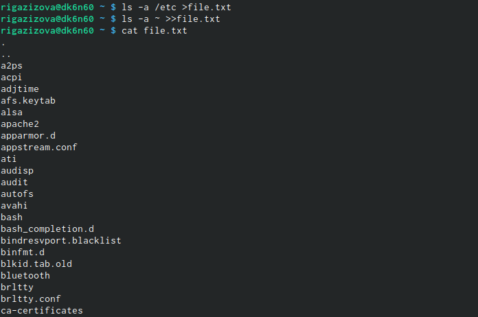{ #fig:001 width=70% }

3. Вывеkb имена всех файлов из file.txt,имеющих расширение.conf,после чего запиcали их в новый текстовой файл conf.txt. (рис. [-@fig:002])

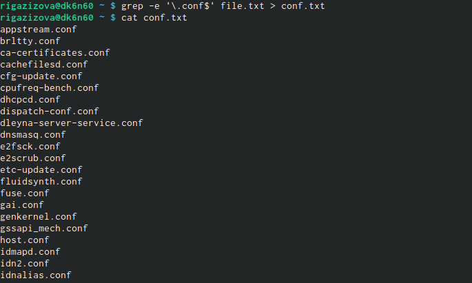{ #fig:002 width=70% }

4. Определили, какие файлы в вашем домашнем каталоге имеют имена,начинавшиесяс символа c. Предложили несколько вариантов,как это сделать. (рис. [-@fig:003] , [-@fig:004])

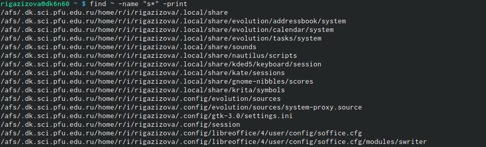{ #fig:003 width=70% }

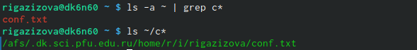{ #fig:004 width=70% }

5. Вывели на экран (по странично) имена файлов из каталога/etc,начинающиесяс символа р.(рис. [-@fig:005])

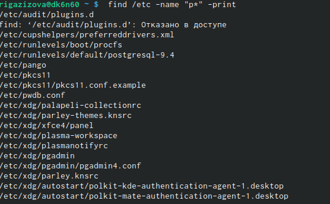{ #fig:005 width=70% }

6. Запустили в фоновом режиме процесс,который будетзаписывать в файл ~/logfile файлы, имена которых начинаются с log. (рис. [-@fig:006], [-@fig:007])

{ #fig:006 width=70% }

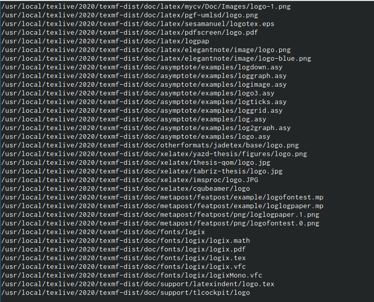{ #fig:007 width=70% }

7. Удалили файл ~/logfile. (рис. [-@fig:008])

{ #fig:008 width=70% }

8. Запустили из консоли в фоновом режиме редактор gedit.И определили идентификатор процесса gedit, используя команду ps, конвейер и фильтр grep.
 (рис. [-@fig:009])

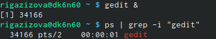{ #fig:009 width=70% }

9. Прочитали справку (man) команды kill, после чего используйте её для завершения процесса gedit. (рис. [-@fig:010])

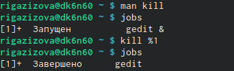{ #fig:010 width=70% }

10. Выполнили команды df и du, предварительно получив более подробную информациюоб этих командах,с помощью команды man. (рис. [-@fig:011], [-@fig:012],  [-@fig:013], [-@fig:014])

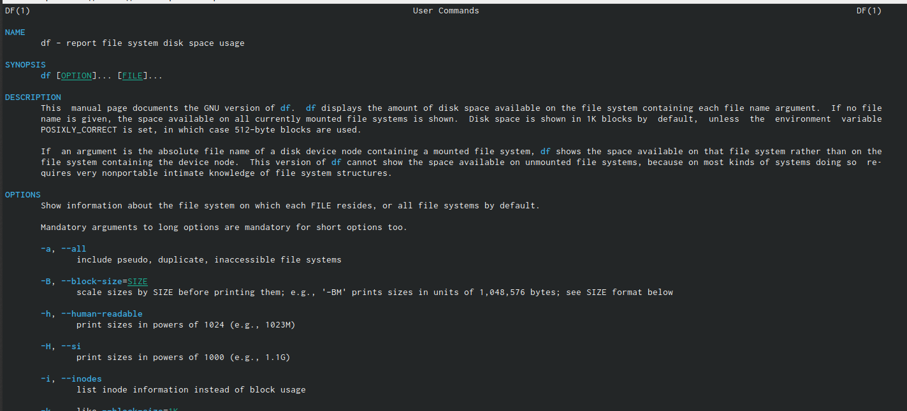{ #fig:011 width=70% }

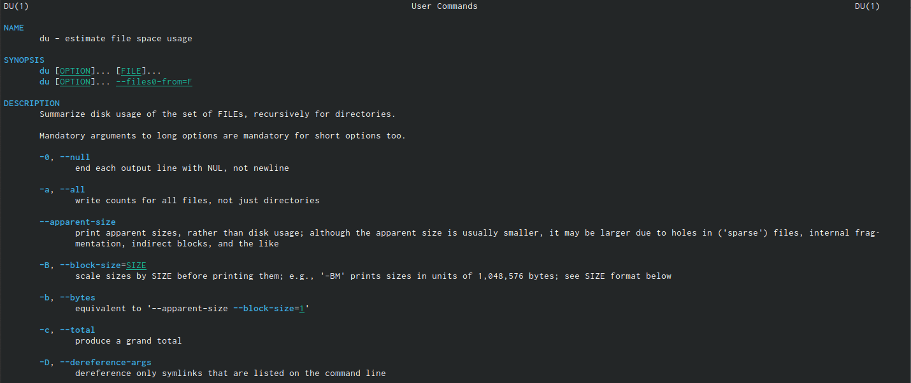{ #fig:012 width=70% }

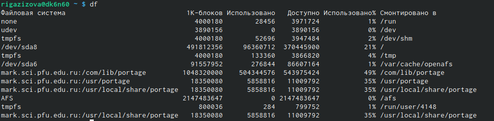{ #fig:013 width=70% }

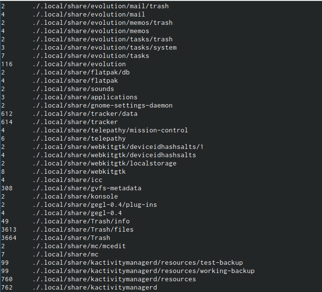{ #fig:014 width=70% }

11. Воспользовавшись справкой команды find, вывели имена всех директорий, имеющихся в нашем домашнем каталоге.(рис. [-@fig:015])

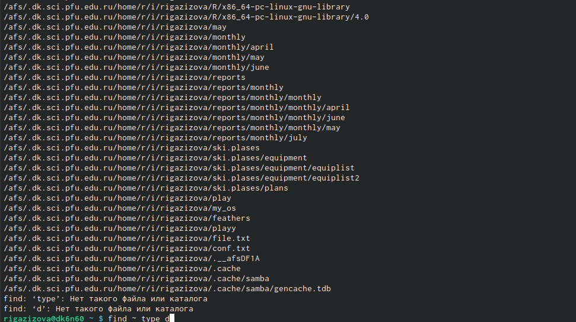{ #fig:015 width=70% }

# Выводы

- Ознакомилась с инструментами поиска файлов и фильтрации текстовых данных. Приобрела практические навыки: по управлению процессами (и заданиями), попроверке использования диска и обслуживанию файловых систем.

