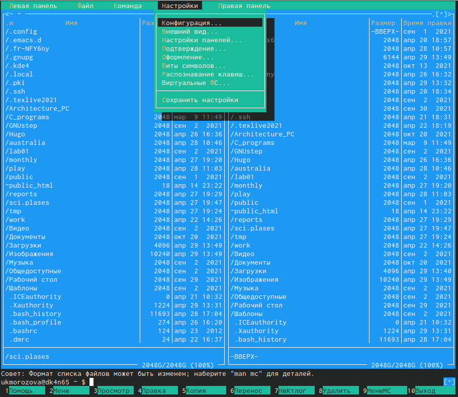

---
## Front matter
lang: ru-RU
title: Презентация по 7 лабораторной работе
author: |
	Газизова Регина {4}
institute: |
	\inst{1}RUDN University, Moscow, Russian Federation
	
date: 11 мая 2022, Москва, Россия

## Formatting
toc: false
slide_level: 2
theme: metropolis
header-includes: 
 - \metroset{progressbar=frametitle,sectionpage=progressbar,numbering=fraction}
 - '\makeatletter'
 - '\beamer@ignorenonframefalse'
 - '\makeatother'
aspectratio: 43
section-titles: true
---

# Midnight Commander
Midnight Commander - это программа, предназначенная для просмотра
содержимого каталогов и выполнения основных функций управления
файлами в UNIX-подобных операционных системах.

# Внешний вид и меню

Интерфейс mc содержит верхнее и нижнее меню. Верхнее меню предназначено для работы с каталогами и файлами, нижнее - это управляющие экранные кнопки, ассоциированные с функциональными клавишами F1 – F10.

# Подменю "Файл"

С помощью подменю файл мы редактировали, просматривали файлы, создавали и копировали каталоги.

# Подменю "Команда"

Подменю "Команда" позволяло нам осуществлять поиск файлов, повотор команд и переход в домашний каталог.

# Подменю "Настройки"

Благодаря подменю "Настройки" можно настраивать внешний вид mc для своего удобства.

# Редактор mc

Встроенный редактор mc позволяет из комадной строки сразу перейти к редактированию и просмотрю файлов.

## {.standout}

The end.
