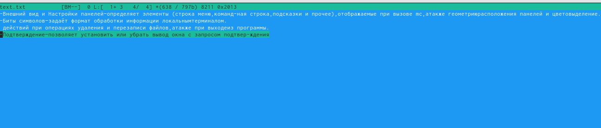
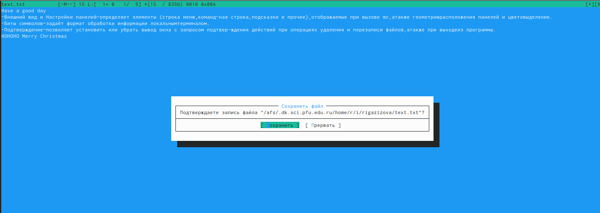

---
## Front matter
title: "Отчет по лабораторной работе №7"
subtitle: "Операционные системы"
author: "Газизова Регина"

## Generic otions
lang: ru-RU
toc-title: "Содержание"

## Bibliography
bibliography: bib/cite.bib
csl: pandoc/csl/gost-r-7-0-5-2008-numeric.csl

## Pdf output format
toc: true # Table of contents
toc-depth: 2
lof: true # List of figures
lot: true # List of tables
fontsize: 12pt
linestretch: 1.5
papersize: a4
documentclass: scrreprt
## I18n polyglossia
polyglossia-lang:
  name: russian
  options:
	- spelling=modern
	- babelshorthands=true
polyglossia-otherlangs:
  name: english
## I18n babel
babel-lang: russian
babel-otherlangs: english
## Fonts
mainfont: PT Serif
romanfont: PT Serif
sansfont: PT Sans
monofont: PT Mono
mainfontoptions: Ligatures=TeX
romanfontoptions: Ligatures=TeX
sansfontoptions: Ligatures=TeX,Scale=MatchLowercase
monofontoptions: Scale=MatchLowercase,Scale=0.9
## Biblatex
biblatex: true
biblio-style: "gost-numeric"
biblatexoptions:
  - parentracker=true
  - backend=biber
  - hyperref=auto
  - language=auto
  - autolang=other*
  - citestyle=gost-numeric
## Pandoc-crossref LaTeX customization
figureTitle: "Рис."
tableTitle: "Таблица"
listingTitle: "Листинг"
lofTitle: "Список иллюстраций"
lotTitle: "Список таблиц"
lolTitle: "Листинги"
## Misc options
indent: true
header-includes:
  - \usepackage{indentfirst}
  - \usepackage{float} # keep figures where there are in the text
  - \floatplacement{figure}{H} # keep figures where there are in the text
---

# Цель работы

Освоение основных возможностей командной оболочки Midnight Commander. Приобретени

# Задание

- Изучите информацию о mc,вызвав в командной строкеman mc.
- Запустите из командной строки mc,изучите его структуру и меню.
- Выполните основные команды меню левой (или правой) панели.Оцените степеньподробности вывода информации о файлах.
- Используя возможности подменюФайл,выполните:–просмотр содержимоготекстового файла;–редактирование содержимого текстового файла (без сохранения результатовредактирования);–создание каталога;–копирование в файлов в созданный каталог.
- С помощью соответствующих средств подменюКомандаосуществите:–поиск в файловой системе файла с заданными условиями (например, файлас расширением.cили.cpp,содержащего строкуmain);–выбор и повторение одной из предыдущих команд;–переход в домашний каталог;–анализ файла меню и файла расширений.
- Вызовите подменюНастройки.Освойте операции,определяющие структуру экрана mc(Full screen,Double Width,Show Hidden Files ит.д.)ю

- Создайтетекстовой файлtext.txt.
- Откройте этот файл с помощью встроенного вmcредактора.
- Вставьте в открытый файл небольшой фрагменттекста,скопированный из любогодругого файла или Интернета.
- Проделайте стекстом следующие манипуляции,используя горячие клавиши:
  -  Удалите строкутекста.
  -  Выделите фрагменттекста и скопируйте его на новую строку.
  - Выделите фрагменттекста и перенесите его на новую строку.
  - Сохраните файл.
  - Отмените последнее действие.
  - Перейдите в конец файла (нажав комбинацию клавиш) и напишите некоторыйтекст.
  - Перейдите в начало файла (нажав комбинацию клавиш) и напишите некоторыйтекст.
  - Сохраните и закройте файл.
- Откройте файл с исходнымтекстом на некотором языке программирования (напри-мер C или Java) 
- Используя меню редактора,включите подсветку синтаксиса,если она не включена,или выключите,если она включена.

# Выполнение лабораторной работы

## Midnight Commander

1. Изучим информацию о mc, вызвав в консоле команду man mc (рис.1). Midnight Commander - это программа, предназначенная для просмотра содержимого каталогов и выполнения основных функций управления файлами в UNIX-подобных операционных системах. 

{ #fig:001 width=70% }

2. Запустим из командной строки mc и изучим его структуру и меню (рис.2-9). Верхнее меню содержит меню "Левая панель", "Файл", "Команда", "Настройка", "Правая панель". С помощью горячих клавиш F1, F2 можно открыть "Помощь" и "Меню пользователя" соответственно.

{ #fig:002 width=70% }

{ #fig:003 width=70% }

{ #fig:004 width=70% }

{ #fig:005 width=70% }

{ #fig:006 width=70% }

{ #fig:007 width=70% }

{ #fig:008 width=70% }

{ #fig:009 width=70% }

3. Выполним операции в mc, используя управляющие клавиши.

  1. Выделение/отмена выделения файлов (рис.10). Выделение файлов происходит с помощью клавиши Insert, ею же можно отменить выделение.

{ #fig:010 width=70% }
 
  2. Копирование/перемещение файлов/каталогов (рис.11-13). Копирование файлов/каталогов осуществляется через клавишу F5, для перемещния - F6.
  
{ #fig:011 width=70% }

{ #fig:012 width=70% }

{ #fig:013 width=70% }

  3. Получение информации о размере и правах доступа на файлы/каталоги и др. (рис.14). Для получения информации воспользуемся кнопкой меню "Правая (Левая) панель" > "Информация".
  
{ #fig:014 width=70% }

4. Выполним основные команды левой (правой) панели. С помощью этого меню можно изменить формат списка файлов (рис.18), фильтровать файлы (рис.15-16) и получить информацию о размере, правах доступа (рис.16-17).

{ #fig:015 width=70% }

{ #fig:016 width=70% }

5. Используя возможности меню "Файл", выполним следующие действия.

  1. Просмотрим содержимое текстового файла. Для этого выделим нужный нам файл (file.txt) и найдем в меню "Файл" пункт "Просмотр файла" (рис.17-18).
  
{ #fig:017 width=70% }

{ #fig:018 width=70% }

  2. Редактиуем содержимое файла, не сохраняя изменения (рис.19-20). В меню "Файл" выберем пункт "Правка".
  
{ #fig:019 width=70% }

{ #fig:020 width=70% }

  3. Создадим новый каталог newpapka, выбрав в меню "Файл" пункт "Создать новый каталог" (рис.21).
  
{ #fig:021 width=70% }

  4. Скопируем в созданный нами каталог файл file.txt (рис.22-23).
  
{ #fig:022 width=70% }

{ #fig:023 width=70% }

6. С помощью соотвествующих пуктов меню "Команда" осуществим следующие действия.

  1. Выполним поиск в файловой системе. Для этого выберем пункт "Поиск файла" и в шаблон имени запишем *.txt (рис.24). Компьютер выведет все файлы расширением markdown (рис.26).
  
{ #fig:024 width=70% }

{ #fig:026 width=70% }

  2. Выберем и повторим одну из предыдущих команд (рис.27). Для этого в меню "Команда" выберем пункт "История командной строки". Но так как мы не вводили в терминал до этого никакую из команд, поле "История" осталось пустым.
  
{ #fig:027 width=70% }

  3. Перейдем в наше домашний каталог (рис.28). Для этого в меню "Команда" выберем пункт "Дерево каталогов" и пройдем весь путь до нашего домашнего каталога /afs/.dk.sci.pfu.edu.ru/home/u/k/ukmorozova.

{ #fig:028 width=70% }

  4. Проведем анализ файла меню (рис.29-30) и файла расширения (рис.31).
  
{ #fig:0029 width=70% }

{ #fig:030 width=70% }

{ #fig:031 width=70% }

7. Вызовем подменю "Настройки" и освоим операции, определяющих структуру экрана mc.

  1. Меню "Конфигурация" (рис.32).
  
{ #fig:032 width=70% }
  
  2. Меню "Внешний вид" (рис.33).

{ #fig:033 width=70% }
  
  3. Меню "Настройка панели" (рис.34).
  
{ #fig:034 width=70% }
  
  4. Меню "Оформление" (рис.35)
  
{ #fig:035 width=70% }

## Редактор mc

1. Создадим файл text.txt (команда touch text.txt) (рис.36).

{ #fig:036 width=70% }

2. Откроем файл с помощью встроенного в mc редактора (рис.37).

{ #fig:037 width=70% }

3. Вставим фрагмент текста в наш файл (рис.38).

{ #fig:038 width=70% }

4. Изменим текст, пользуясь горячие клавиши:

  1. Удалим строку текста с помощью комбинацией клавиш Ctrl+y (рис.39)
  
{ #fig:039 width=70% }
 
  2. Выделим фрагмент текста и скопируем его на новую строку (F3+F5) (рис.40)

{ #fig:040 width=70% }

  3. Выделим фрагмент текста и перенесем его на новую строку (F3+F6) (рис.41).

{ #fig:041 width=70% }

  4. Сохраним файл (F2) (рис.42)

{ #fig:042 width=70% }
 
  5. Отменим последнее действие (Ctrl+u) 

  6. Перейдем в конец файла (комбинация Ctrl+End) и напишем текст (рис.43)
  
{ #fig:043 width=70% }

  7. Перейдем в начало файла (комбинация Ctrl+Home) и напишем текст (рис.44)
  
{ #fig:044 width=70% }

  8. Сохраним и закроем файл (рис.45)
  
{ #fig:045 width=70% }

5. Откроем файл с исходным текстом на языке программирования C++  и, используя esc+y уберем подсветку синаксиса (рис.46-47).

{ #fig:046 width=70% }

{ #fig:047 width=70% }

# Выводы

Я освоила основных возможностей командной оболочки Midnight Commander, приобрела навыки практической работы по просмотру каталогов и файлов; манипуляций с ними.

# Контрольные вопросы

1. Панели могут дополнительно быть переведены в один из двух режимов: «Информация» или «Дерево». В режиме «Информация» на панель выводятся сведения о файле и текущей файловой системе, расположенных на активной панели. В режиме «Дерево» на одной из панелей выводится структура дерева каталогов.

2. Как с помощью команд shell, так и с помощью меню (комбинаций клавиш) mc можно выполнить следующие операции с файлами:

- копирование «F5» («cp имя_файла имя_каталога (в который копируем)») (Рисунок14)

- перемещение/переименование «F6» («mv имя_файла имя_каталога (в который перемещаем)»)(Рисунок15)

- создание каталога «F7» («mkdir имя_каталога»)(Рисунок38)

- удаление «F8» («rm имя_файла»)

- изменение прав доступа «ctrl+x» («chmod u+x имя_файла»)

3. Перейти в строку меню панелей mc можно с помощью функциональной клавиши «F9». В строке меню имеются пять меню: «Леваяпанель», «Файл», «Команда», «Настройки» и «Праваяпанель».
Под пункт меню «Быстрый просмотр» позволяет выполнить быстрый просмотр содержимого панели.

Подпункт меню «Информация» позволяет посмотреть информацию о файле или каталоге. В меню каждой (левой или правой) панели можно выбрать «Формат списка»:

- стандартный − выводит список файлов и каталогов с указанием размера и времени правки;

- ускоренный − позволяет задать число столбцов, на которые разбивается панель при выводе списка имён файлов или каталогов без дополнительной информации;

- расширенный − помимо названия файла или каталога выводит сведения о правах доступа, владельце, группе, размере, времени правки;

- определённый пользователем − позволяет вывести те сведения о файле или каталоге, которые задаст сам пользователь.

Подпункт меню «Порядок сортировки» позволяет задать критерии сортировки при выводе списка файлов и каталогов: без сортировки, по имени, расширенный, время правки, время доступа, время изменения атрибута, размер, узел.

4. Команды меню «Файл»:
- Просмотр(«F3»)− позволяет посмотреть содержимое текущего (или выделенного) файла без возможности редактирования.

- Просмотр вывода команды («М»+«!»)− функция запроса команды с параметрами (аргумент к текущему выбранному файлу).

- Правка(«F4») − открывает текущий (или выделенный) файл для его редактирования.

- Копирование(«F5»)− осуществляет копирование одного или нескольких файлов или каталогов в указанное пользователем во всплывающем окне место.

- Права доступа («Ctrl-x»«c»)− позволяет указать (изменить) права доступа к одному или нескольким файлам или каталогам.

- Жёсткая ссылка («Ctrl-x»«l»)− позволяет создать жёсткую ссылку к текущему(или выделенному) файлу.

- Символическая ссылка («Ctrl-x»«s»)− позволяет создать символическую ссылку к текущему (или выделенному) файлу.

- Владелец/группа («Ctrl-x»«o»)− позволяет задать (изменить) владельца и имя группы для одного или нескольких файлов или каталогов.

- Права(расширенные)− позволяет изменить права доступа и владения для одного или нескольких файлов или каталогов.

- Переименование («F6»)− позволяет переименовать (или переместить) один или несколько файлов или каталогов.

- Создание каталога («F7») − позволяет создать каталог.

- Удалить («F8») − позволяет удалить один или несколько файлов или каталогов.

- Выход («F10») − завершает работу mc.

5. Меню Команда
В меню Команда содержатся более общие команды для работы с mc.

Команды меню Команда:

Дерево каталогов − отображает структуру каталогов системы.

Поиск файла − выполняет поиск файлов по заданным параметрам.

Переставить панели − меняет местами левую и правую панели.

Сравнить каталоги («Ctrl-x»«d») − сравнивает содержимое двух каталогов.

Размеры каталогов − отображает размер и время изменения каталога (по умолчанию в mc размер каталога корректно не отображается).

История командной строки − выводит на экран список ранее выполненных в оболочке команд.

Каталоги быстрого доступа(Ctrl-\»)− при вызове выполняется быстрая смена текущего каталога на один из заданного списка.

Восстановление файлов − позволяет восстановить файлы на файловых системах ext2 и ext3.

Редактировать файл расширений − позволяет задать с помощью определённого синтаксиса действия при запуске файлов с определённым расширением (например, какое программное обеспечение запускать для открытия или редактирования файлов с расширением doc или docx).

Редактировать файл меню − позволяет отредактировать контекстное меню пользователя, вызываемое по клавише «F2».

Редактировать файл расцветки имён − позволяет подобрать оптимальную для пользователя расцветку имён файлов в зависимости от их типа.

6. Меню Настройки содержит ряд дополнительных опций по внешнему виду и функциональности mc.
Меню Настройки содержит:

Конфигурация − позволяет скорректировать настройки работы с панелями.

Внешний вид и Настройки панелей − определяет элементы (строка меню, командная строка, подсказки и прочее), отображаемые при вызове mc, а также геометрию расположения панелей и цветовыделение.

Биты символов − задаёт формат обработки информации локальным терминалом.

Подтверждение − позволяет установить или убрать вывод окна с запросом подтверждения действий при операциях удаления и перезаписи файлов, а также при выходе из программы.

Распознание клавиш − диалоговое окно используется для тестирования функциональных клавиш, клавиш управления курсором и прочее.

Виртуальные ФС − настройки виртуальной файловой системы: тайм-аут, пароль и прочее.

7. Функциональные клавиши mc:
F1 – вызов контекстно-зависимой подсказки

F2 – вызов пользовательского меню с возможностью создания и/или дополнения дополнительных функций

F3 – просмотр содержимого файла, на который указывает подсветка в активной панели (без возможности редактирования)

F4 – вызов встроенного в mc редактора для изменения содержания файла, на который указывает подсветка в активной панели

F5 – копирование одного или нескольких файлов, отмеченных впервой (активной) панели, в каталог, отображаемый на второй панели

F6 – перенос одного или нескольких файлов, отмеченных в первой (активной) панели, в каталог, отображаемый на второй панели

F7 – создание подкаталога в каталоге, отображаемом в активной панели

F8 – удаление одного или нескольких файлов (каталогов), отмеченных в первой (активной) панели файлов

F9 – вызов меню mc

F10 – выход из mc

8. Встроенный в mc редактор вызывается с помощью функциональной клавиши «F4». В нём удобно использовать различные комбинации клавиш при редактировании содержимого (как правило текстового) файла. Клавиши для редактирования файла:
«Ctrl-y» − удалить строку

«Ctrl-u» − отмена последней операции

«ins» - вставка/замена

«F7» − поиск (можно использовать регулярные выражения)

«↑-F7» − повтор последней операции поиска

«F4» − замена

«F3» − первое нажатие − начало выделения, второе − окончание выделения

«F5» − копировать выделенный фрагмент

«F6» − переместить выделенный фрагмент

«F8» − удалить выделенный фрагмент

«F2» − записать изменения в файл

«F10» − выйти из редактор

9. Для редактирования меню пользователя, которое вызывается клавишей «F2», необходимо перейти в пункт «Редактировать файл меню» → «Команда» и изменить настройки файла.

10. Часть команд «Меню пользователя», а также меню «Файл» позволяют выполнять действия, определяемые пользователем, над текущим файлом. Например, копирование каталога или файла, переименование, перемещение, архивирование.

::: {#refs}
:::
