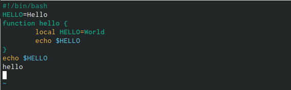

---
## Front matter
lang: ru-RU
title: Лабораторная №8
author: |
	Газизова Реигна{4}
institute: |
	\inst{1}RUDN University, Moscow, Russian Federation
	
date: 12 мая 2022, Москва, Россия

## Formatting
toc: false
slide_level: 2
theme: metropolis
header-includes: 
 - \metroset{progressbar=frametitle,sectionpage=progressbar,numbering=fraction}
 - '\makeatletter'
 - '\beamer@ignorenonframefalse'
 - '\makeatother'
aspectratio: 43
section-titles: true
---

# Презентация по работе с редактором  vi

## Редактор vi

 Редактор имее три режима работы
 
- Командный режим, который предназначен для ввода команд редактирования и навигации по редактируемому файлу.

- Режим вставки. Он предназначен для ввода содержания редактируемого файла.

- Режим последней строки - используется для записи изменений в файл и выхода из редактора.

Для вызова vi нужно указать саму команду vi и имя файла для редакции.

## Создание нового файла 

- Создала и открыла файл с помощью vi
- В режиме вставки напечатала нужный текст
- Перешла в режим последний строки для сохранения и выхода.

{ #fig:001 width=70% }

## Редактирование файла
 
 Редактор vi  осуществляет редактирование файла через командный режим с помощью сочетания клавиш на клавиатуре. 
 
## Вывод

В ходе работы я научилась пользоваться различными командами в редакторе vi - удаление/вставка строки, отмена последнего действия.

## {.standout}

The End
