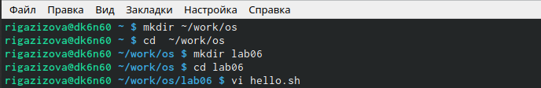
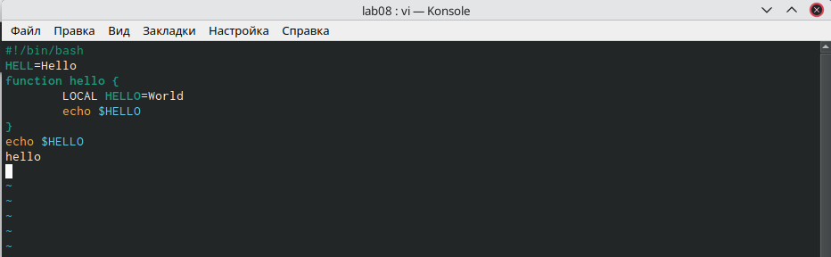
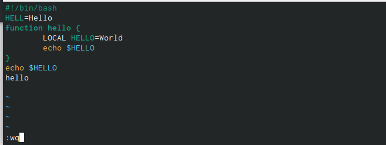
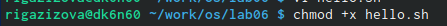
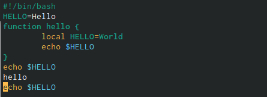
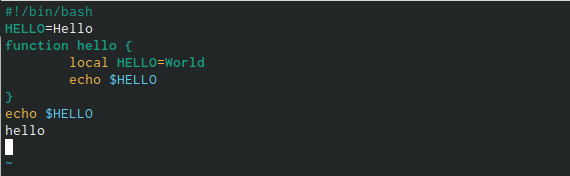
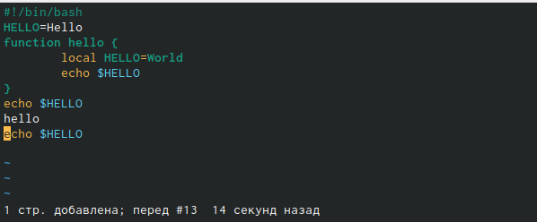
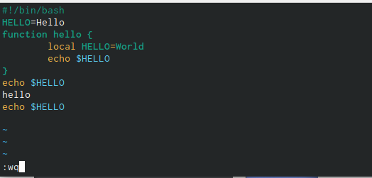

---
## Front matter
title: "Шаблон отчёта по лабораторной работе"
subtitle: "Простейший вариант"
author: "Дмитрий Сергеевич Кулябов"

## Generic otions
lang: ru-RU
toc-title: "Содержание"

## Bibliography
bibliography: bib/cite.bib
csl: pandoc/csl/gost-r-7-0-5-2008-numeric.csl

## Pdf output format
toc: true # Table of contents
toc-depth: 2
lof: true # List of figures
lot: true # List of tables
fontsize: 12pt
linestretch: 1.5
papersize: a4
documentclass: scrreprt
## I18n polyglossia
polyglossia-lang:
  name: russian
  options:
	- spelling=modern
	- babelshorthands=true
polyglossia-otherlangs:
  name: english
## I18n babel
babel-lang: russian
babel-otherlangs: english
## Fonts
mainfont: PT Serif
romanfont: PT Serif
sansfont: PT Sans
monofont: PT Mono
mainfontoptions: Ligatures=TeX
romanfontoptions: Ligatures=TeX
sansfontoptions: Ligatures=TeX,Scale=MatchLowercase
monofontoptions: Scale=MatchLowercase,Scale=0.9
## Biblatex
biblatex: true
biblio-style: "gost-numeric"
biblatexoptions:
  - parentracker=true
  - backend=biber
  - hyperref=auto
  - language=auto
  - autolang=other*
  - citestyle=gost-numeric
## Pandoc-crossref LaTeX customization
figureTitle: "Рис."
tableTitle: "Таблица"
listingTitle: "Листинг"
lofTitle: "Список иллюстраций"
lotTitle: "Список таблиц"
lolTitle: "Листинги"
## Misc options
indent: true
header-includes:
  - \usepackage{indentfirst}
  - \usepackage{float} # keep figures where there are in the text
  - \floatplacement{figure}{H} # keep figures where there are in the text
---

# Цель работы

Освоение основных возможностей командной оболочки Midnight Commander. Приобретени

# Задание

- Изучите информацию о mc,вызвав в командной строкеman mc.
- Запустите из командной строки mc,изучите его структуру и меню.
- Выполните основные команды меню левой (или правой) панели.Оцените степеньподробности вывода информации о файлах.
- Используя возможности подменюФайл,выполните:–просмотр содержимоготекстового файла;–редактирование содержимого текстового файла (без сохранения результатовредактирования);–создание каталога;–копирование в файлов в созданный каталог.
- С помощью соответствующих средств подменюКомандаосуществите:–поиск в файловой системе файла с заданными условиями (например, файлас расширением.cили.cpp,содержащего строкуmain);–выбор и повторение одной из предыдущих команд;–переход в домашний каталог;–анализ файла меню и файла расширений.
- Вызовите подменюНастройки.Освойте операции,определяющие структуру экрана mc(Full screen,Double Width,Show Hidden Files ит.д.)ю

- Создайтетекстовой файлtext.txt.
- Откройте этот файл с помощью встроенного вmcредактора.
- Вставьте в открытый файл небольшой фрагменттекста,скопированный из любогодругого файла или Интернета.
- Проделайте стекстом следующие манипуляции,используя горячие клавиши:
  -  Удалите строкутекста.
  -  Выделите фрагменттекста и скопируйте его на новую строку.
  - Выделите фрагменттекста и перенесите его на новую строку.
  - Сохраните файл.
  - Отмените последнее действие.
  - Перейдите в конец файла (нажав комбинацию клавиш) и напишите некоторыйтекст.
  - Перейдите в начало файла (нажав комбинацию клавиш) и напишите некоторыйтекст.
  - Сохраните и закройте файл.
- Откройте файл с исходнымтекстом на некотором языке программирования (напри-мер C или Java) 
- Используя меню редактора,включите подсветку синтаксиса,если она не включена,или выключите,если она включена.

# Выполнение лабораторной работы

## Midnight Commander

1. Изучим информацию о mc, вызвав в консоле команду man mc (рис.1). Midnight Commander - это программа, предназначенная для просмотра содержимого каталогов и выполнения основных функций управления файлами в UNIX-подобных операционных системах. 

{ #fig:001 width=70% }

2. Запустим из командной строки mc и изучим его структуру и меню (рис.2-9). Верхнее меню содержит меню "Левая панель", "Файл", "Команда", "Настройка", "Правая панель". С помощью горячих клавиш F1, F2 можно открыть "Помощь" и "Меню пользователя" соответственно.

{ #fig:002 width=70% }

{ #fig:003 width=70% }

{ #fig:004 width=70% }

{ #fig:005 width=70% }

{ #fig:006 width=70% }

{ #fig:007 width=70% }

{ #fig:008 width=70% }

{ #fig:009 width=70% }

# Выводы

Здесь кратко описываются итоги проделанной работы.

# Список литературы{.unnumbered}

::: {#refs}
:::
