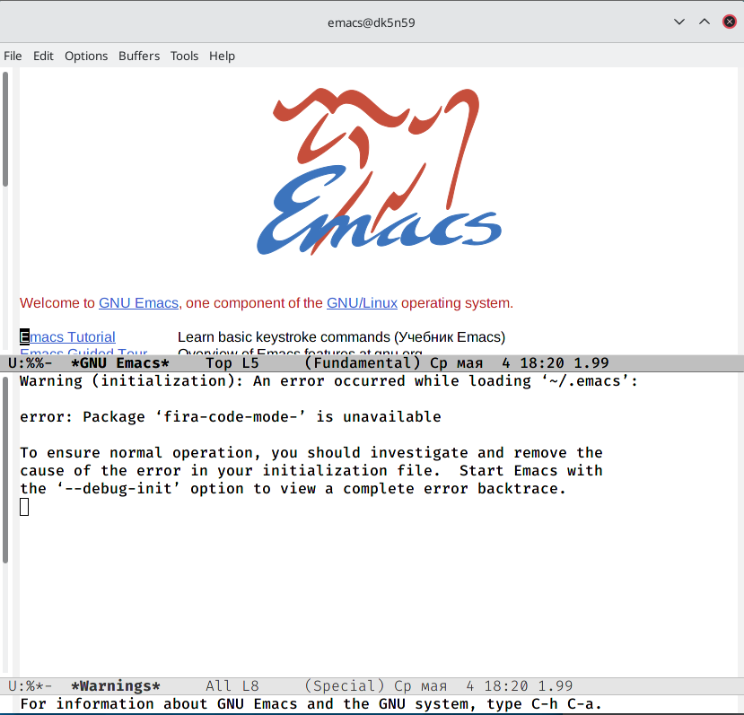

---
## Front matter
lang: ru-RU
title: Лаборатоная работа №9
author: |
	Газизова Регина{4}
institute: |
	\inst{1}RUDN University, Moscow, Russian Federation
	
date: 19 мая 2022, Москва, Россия

## Formatting
toc: false
slide_level: 2
theme: metropolis
header-includes: 
 - \metroset{progressbar=frametitle,sectionpage=progressbar,numbering=fraction}
 - '\makeatletter'
 - '\beamer@ignorenonframefalse'
 - '\makeatother'
aspectratio: 43
section-titles: true
---

# Редактор emacs

Emacs представляет собой мощный экранный редактор текста, написанный на языке высокого уровня Elisp.

# Буфер в emacs

Буфер — объект, представляющий какой-либо текст.
Буфер может содержать что угодно, например, результаты компиляции программы
или встроенные подсказки. Практически всё взаимодействие с пользователем, в том
числе интерактивное, происходит посредством буферов.

# Работа в редакторе

Для запуска Emacs необходимо в командной строке набрать emacs (или emacs & для работы в фоновом режиме относительно консоли).
Для работы с Emacs можно использовать как элементы меню, так и различные сочетания клавиш.

# Редактирование файла

 - Вставка
 - Удаление
 - Выделять
 - и т.п.

# Использование фреймов

 - Можно работать сразу с несколькими буферами
 - Создание фреймов

# Поиск по файлу

 - Несколько способов поиска
 
 
## {.standout}

That's all
