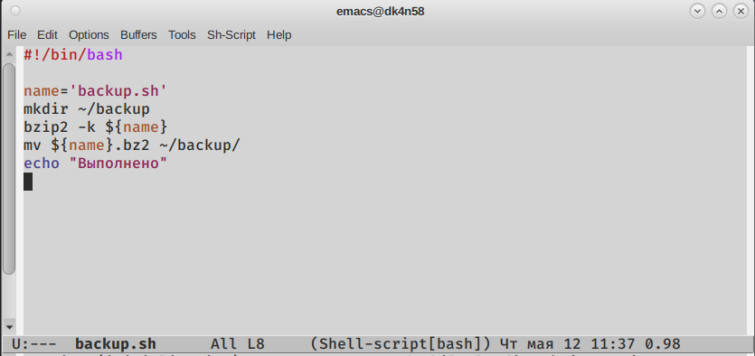
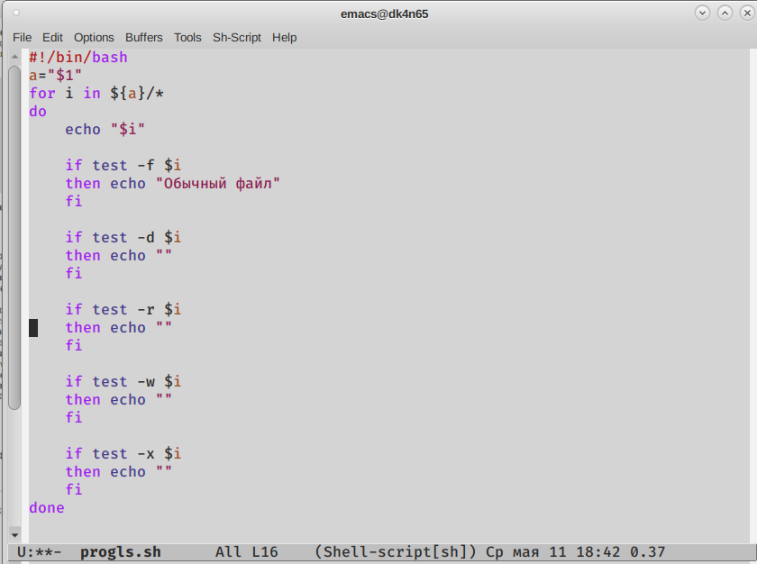
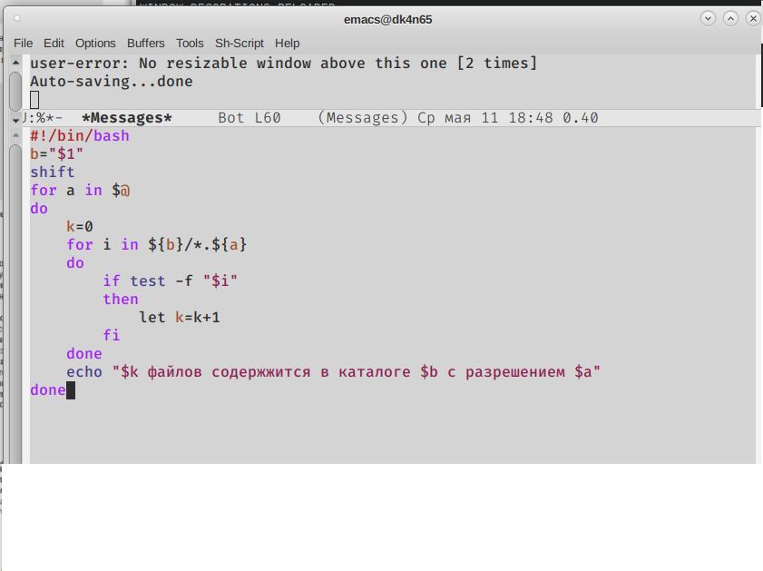

---
## Front matter
lang: ru-RU
title: Лабораторная работа №10
author: |
	Газизова Регина{4}
institute: |
	\inst{1}RUDN University, Moscow, Russian Federation
	
date: 19 мая 2022, Москва, Россия

## Formatting
toc: false
slide_level: 2
theme: metropolis
header-includes: 
 - \metroset{progressbar=frametitle,sectionpage=progressbar,numbering=fraction}
 - '\makeatletter'
 - '\beamer@ignorenonframefalse'
 - '\makeatother'
aspectratio: 43
section-titles: true
---

# Первая программа

Резервная копия самого себя

# Вторая программа

Вывод аргументов

# Третья программа

Команда-замена ls

# Четвертая программа

Поиск файлов

## {.standout}

Thanks for attention
