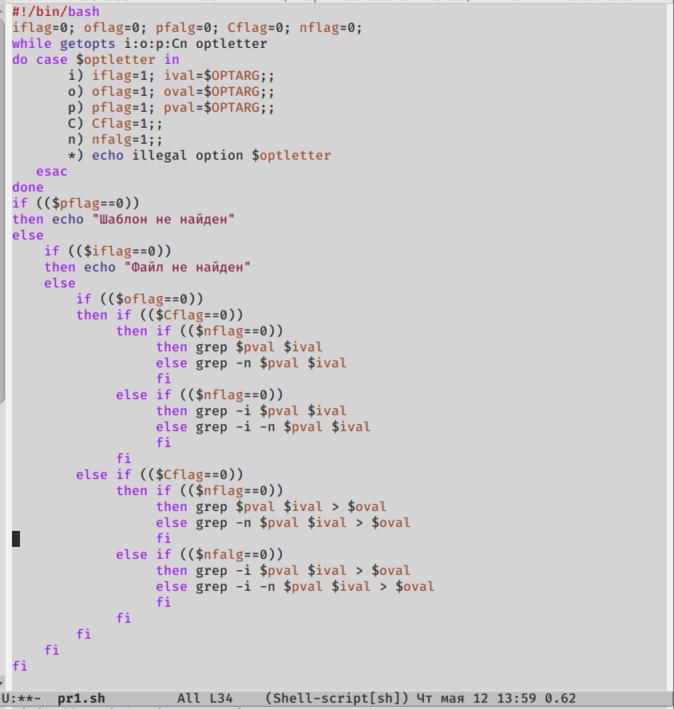
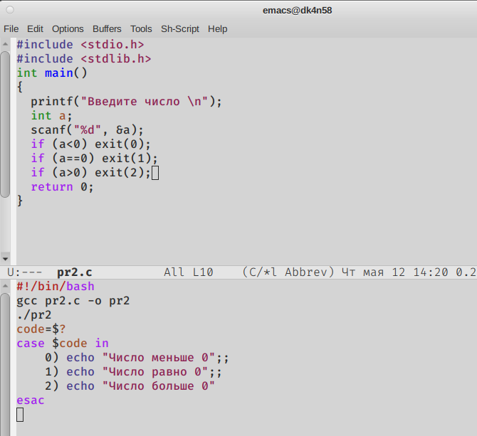
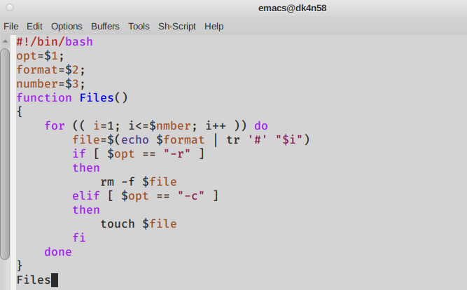
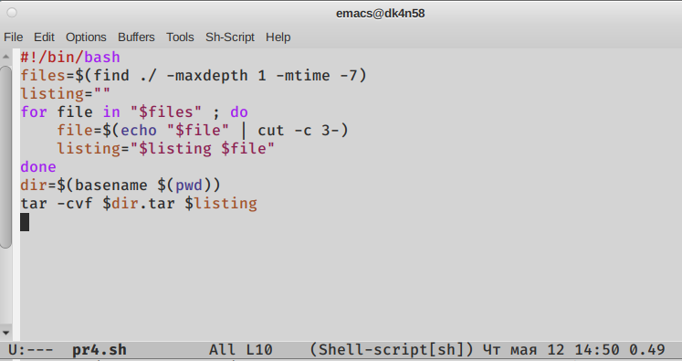

---
## Front matter
lang: ru-RU
title: Лабораторная №11
author: |
	Газизова Регина\inst{4}
institute: |
	\inst{1}RUDN University, Moscow, Russian Federation
	
date: 26 мая 2022, Москва

## Formatting
toc: false
slide_level: 2
theme: metropolis
header-includes: 
 - \metroset{progressbar=frametitle,sectionpage=progressbar,numbering=fraction}
 - '\makeatletter'
 - '\beamer@ignorenonframefalse'
 - '\makeatother'
aspectratio: 43
section-titles: true
---

# Первый командный файл
 - Поиск в указанном файле нужные строки

{ #fig:002 width=70% }

# Второй командный файл
 - Вызов программы С через командный файл

{ #fig:005 width=70% }

# Третий командный файл
 - Создание указанного количества файлов
 
 { #fig:007 width=70% }

# Четвертый командный файл
 - Упаковка в архив всех файлов в текущей директории
 
 { #fig:009 width=70% }

## {.standout}

That's all
