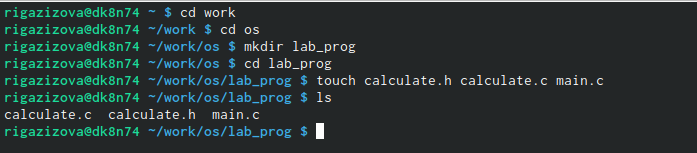
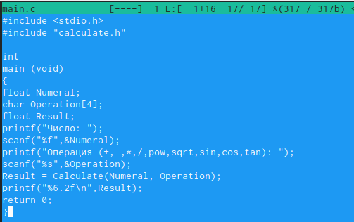
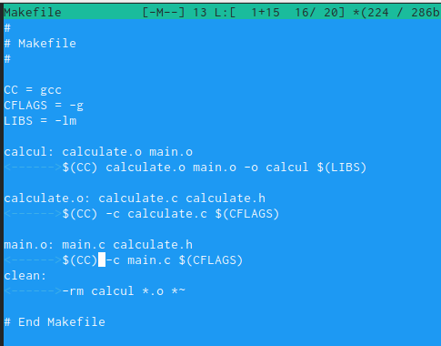
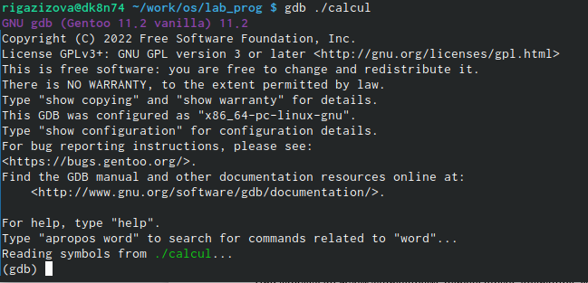

---
## Front matter
lang: ru-RU
title: Лабораторная №13
author: |
	Газизова Регина\inst{4}
institute: |
	\inst{1}RUDN University, Moscow, Russian Federation
	
date: 3 июня 2022, Москва, Россия

## Formatting
toc: false
slide_level: 2
theme: metropolis
header-includes: 
 - \metroset{progressbar=frametitle,sectionpage=progressbar,numbering=fraction}
 - '\makeatletter'
 - '\beamer@ignorenonframefalse'
 - '\makeatother'
aspectratio: 43
section-titles: true
---

# Презентация по лабораторной №13

## Создание каталога

Создаем необходимые файлы.

## Программа

Записываем текст программы в файлы.

## Makefile

Создаем makefile и с помощью него компилируем необходимые файлы.

## Отладка

С помощью gdb производим отладку.

## {.standout}

Всё!
