---
## Front matter
lang: ru-RU
title: Отчёт по первому этапу ИП
author: |
	Газизова Регина
institute: |
	РУДН, Москва, Россия
date: 29 апреля 2022

## Formatting
toc: false
slide_level: 2
theme: metropolis
header-includes: 
 - \metroset{progressbar=frametitle,sectionpage=progressbar,numbering=fraction}
 - '\makeatletter'
 - '\beamer@ignorenonframefalse'
 - '\makeatother'
aspectratio: 43
section-titles: true
---

## Цель работы

Разместить на Github pages заготовки для персонального сайта.

# Ход лабораторной работы

## Скачиваем шаблон темы сайта и переносим его в наш репозиторий

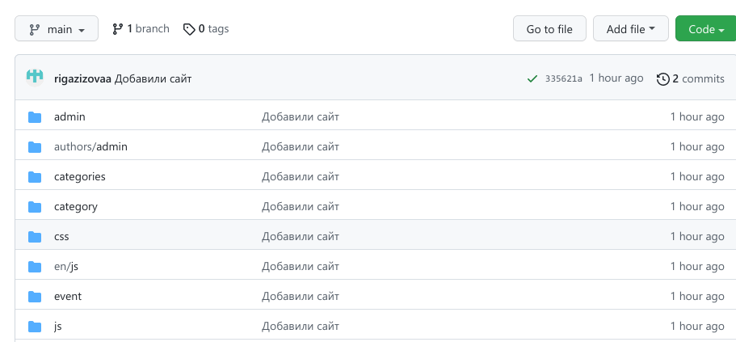{ #fig:001 width=70% }

## Размещаем его на хостинге git.

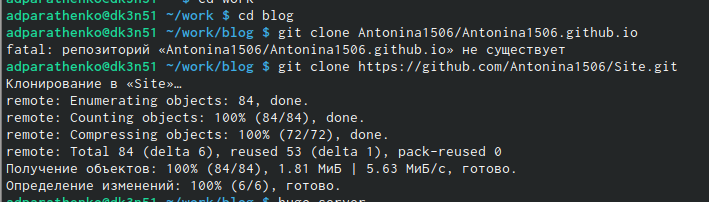{ #fig:002 width=70% }

## Устанавливаем параметр для URLs сайта. 

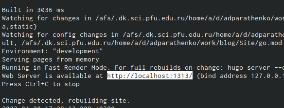{ #fig:003 width=70% }

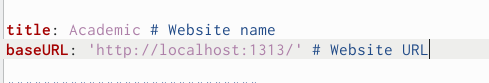{ #fig:004 width=70% }
	
## Создаём пустой репозиторий с именем rigazizovaa.github.io 
	
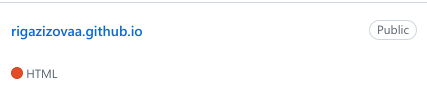{ #fig:005 width=70% }
	
## Клонируем созданный репозиторий
	
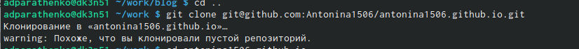{ #fig:006 width=70% }

## Переходим на главную ветку репозитория и создаём пустой файл README.md 

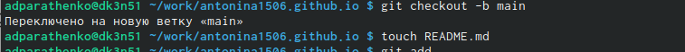{ #fig:007 width=70% }

## Перекидываем файл в репозиторий на github
	
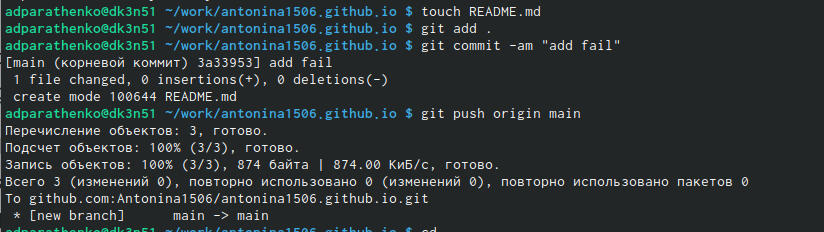{ #fig:008 width=70% }

## Меняем адрес сайта в файле config.yaml, вызывая редактирование файла в консоле	
	
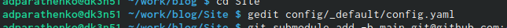{ #fig:009 width=70% }
	
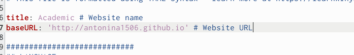{ #fig:010 width=70% }
		
##  Создаём каталог publiс и привязываем к нему репозиторий rigazizovaa.github.io
### Репозиторий не привязывается т.к. public игнорируется 

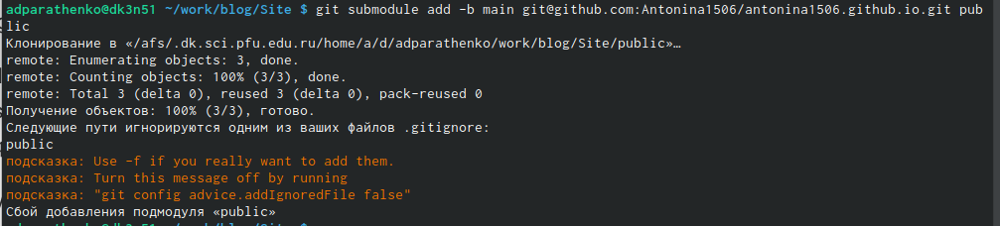{ #fig:011 width=70% }

##  Создаём каталог publiс и привязываем к нему репозиторий rigazizovaa.github.io
### В файле каталога Site делаем так, что бы каталог public не игнорировался
	
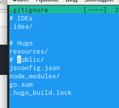{ #fig:012 width=40% }

##  Создаём каталог publiс и привязываем к нему репозиторий rigazizovaa.github.io
### Снова привязываем репозиторий и нам это удаётся

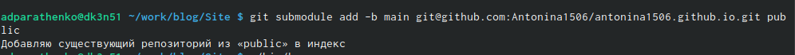{ #fig:013 width=70% }

## Вызываем hugo, чтобы скомпелировать файлы

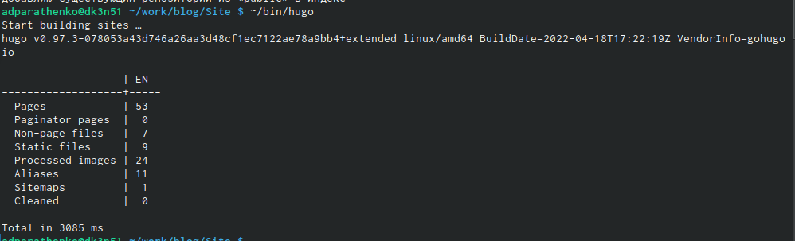{ #fig:014 width=70% }

## Загружаем всё на github

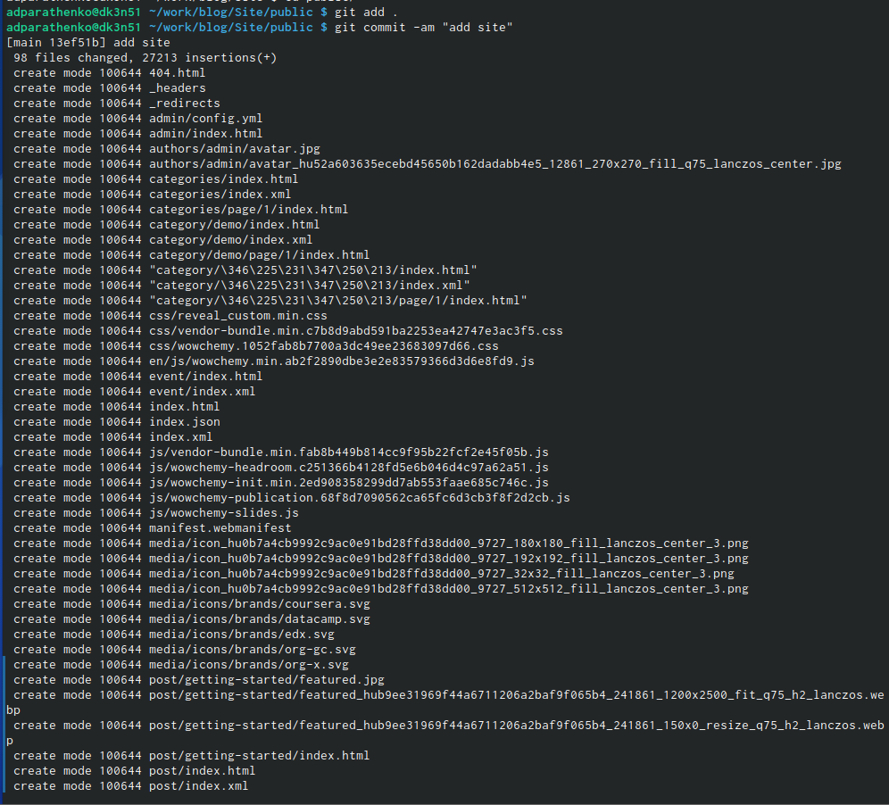{ #fig:015 width=70% }

## Загружаем всё на github
		
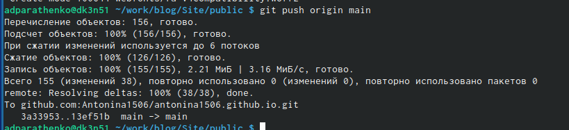{ #fig:016 width=80% }	
 
## Проверяем выгрузку файлов на github

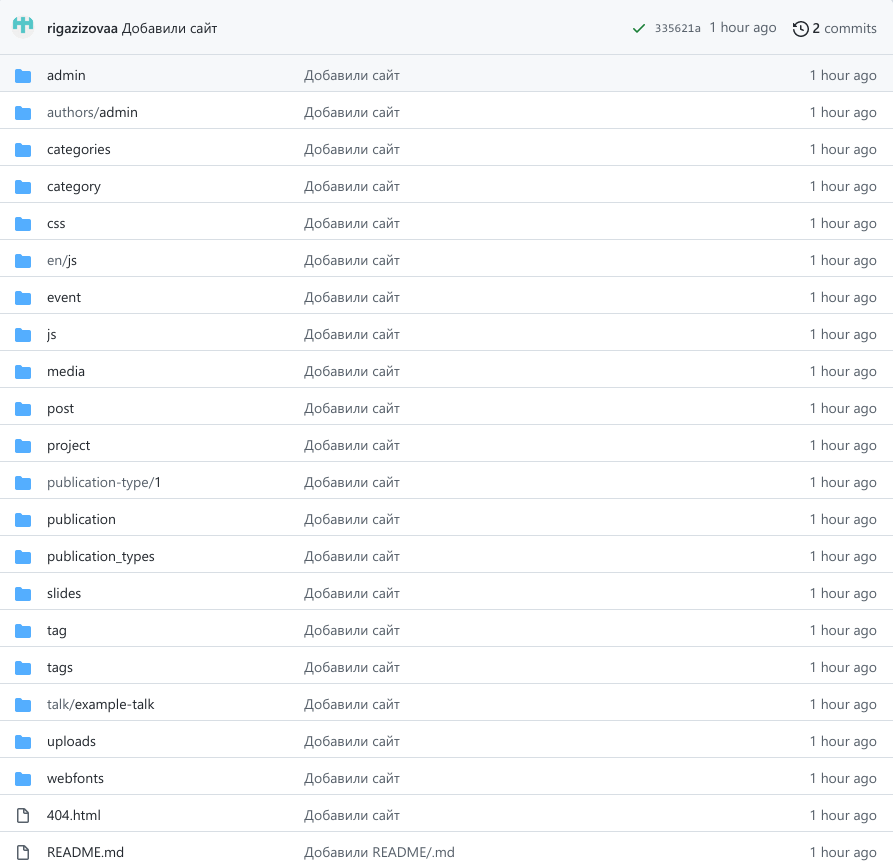{ #fig:017 width=70% }
 
## Итоговый сайт

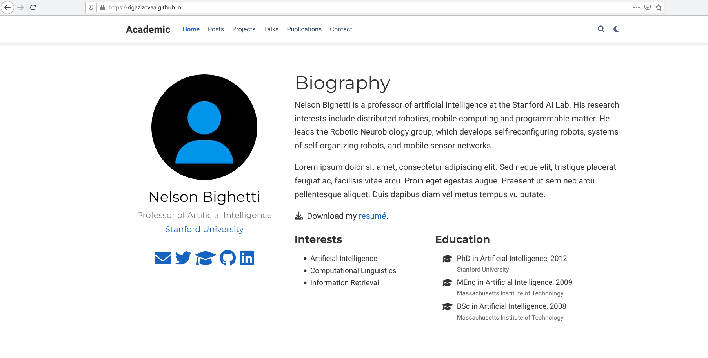{ #fig:018 width=70% }

## Вывод: 
Научились использовать шаблоны сайта с github и размещать на Github pages заготовки для персонального сайта.

