---
## Front matter
title: " Отчёт по первому этапу проекта"
author: "Газизова Регина"

## Generic otions
lang: ru-RU
toc-title: "Содержание"

## Bibliography
bibliography: bib/cite.bib
csl: pandoc/csl/gost-r-7-0-5-2008-numeric.csl

## Pdf output format
toc: true # Table of contents
toc-depth: 2
lof: true # List of figures
lot: true # List of tables
fontsize: 12pt
linestretch: 1.5
papersize: a4
documentclass: scrreprt
## I18n polyglossia
polyglossia-lang:
  name: russian
  options:
	- spelling=modern
	- babelshorthands=true
polyglossia-otherlangs:
  name: english
## I18n babel
babel-lang: russian
babel-otherlangs: english
## Fonts
mainfont: PT Serif
romanfont: PT Serif
sansfont: PT Sans
monofont: PT Mono
mainfontoptions: Ligatures=TeX
romanfontoptions: Ligatures=TeX
sansfontoptions: Ligatures=TeX,Scale=MatchLowercase
monofontoptions: Scale=MatchLowercase,Scale=0.9
## Biblatex
biblatex: true
biblio-style: "gost-numeric"
biblatexoptions:
  - parentracker=true
  - backend=biber
  - hyperref=auto
  - language=auto
  - autolang=other*
  - citestyle=gost-numeric
## Pandoc-crossref LaTeX customization
figureTitle: "Рис."
tableTitle: "Таблица"
listingTitle: "Листинг"
lofTitle: "Список иллюстраций"
lotTitle: "Список таблиц"
lolTitle: "Листинги"
## Misc options
indent: true
header-includes:
  - \usepackage{indentfirst}
  - \usepackage{float} # keep figures where there are in the text
  - \floatplacement{figure}{H} # keep figures where there are in the text
---

# Цель работы

Разместить на Github pages заготовки для персонального сайта.

# Выполнение первого этапа проекта

1) Скачиваем шаблон темы сайта и переносим его в наш репозиторий (рис. [-@fig:001])

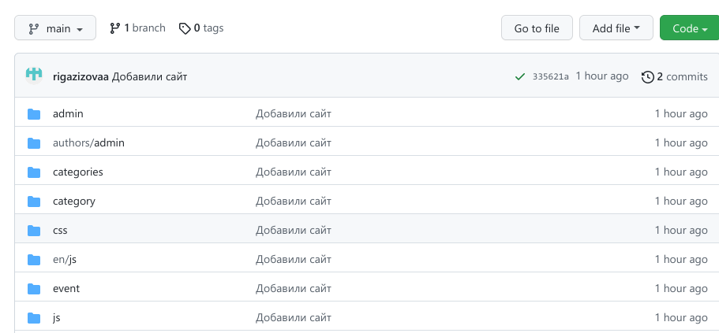{ #fig:001 width=70% }

2) Размещаем его на хостинге git.(рис. [-@fig:002])

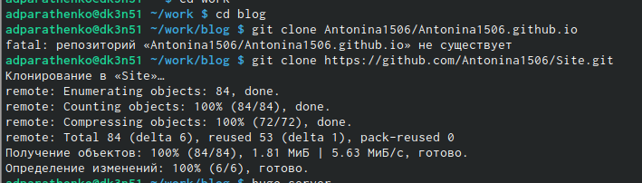{ #fig:002 width=70% }

3) Устанавливаем параметр для URLs сайта.  (рис. [-@fig:003]) и (рис. [-@fig:003])

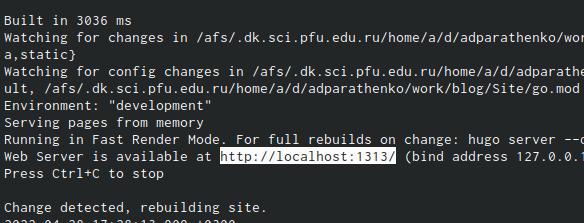{ #fig:003 width=70% }

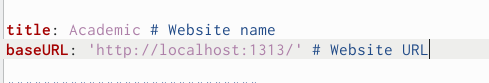{ #fig:004 width=70% }

4) Разместить заготовку сайта на Github pages.
	1) Создаём пустой репозиторий с именем antonina1506.github.io (рис. [-@fig:005])
	
	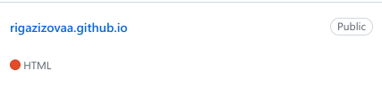{ #fig:005 width=70% }
	
	2) Клонируем созданный репозиторий (рис. [-@fig:006])
	
	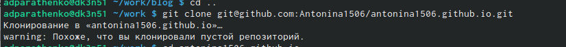{ #fig:006 width=70% }
	
	3) Переходим на главную ветку репозитория и создаём пустой файл README.md (рис. [-@fig:007])
	
	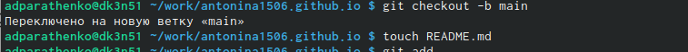{ #fig:007 width=70% }
	
	4) Перекидываем файл в репозиторий на github (рис. [-@fig:008])
	
	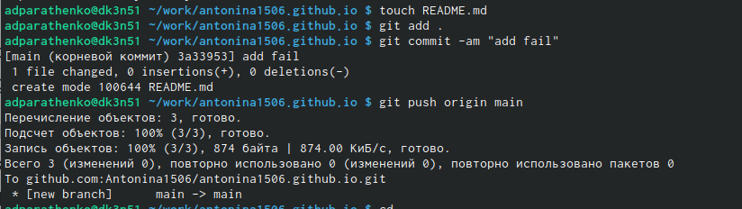{ #fig:008 width=70% }
	
	5) Меняем адрес сайта в файле config.yaml, вызывая редактирование файла в консоле (рис. [-@fig:009]) (рис. [-@fig:010])
	
	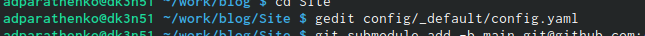{ #fig:009 width=70% }
	
	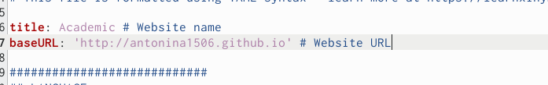{ #fig:010 width=70% }
	
	6) Создаём каталог publiс и привязываем к нему репозиторий antonina.github.io
		1) Репозиторий не привязывается т.к. public игнорируется (рис. [-@fig:011])
		
		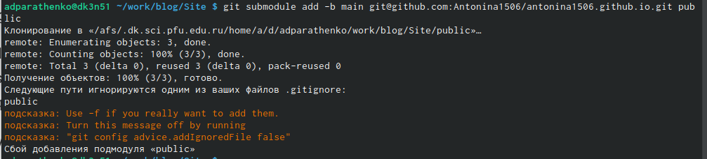{ #fig:011 width=70% }
		
		2) В файле каталога Site делаем так, что бы каталог public не игнорировался (рис. [-@fig:012])
		
		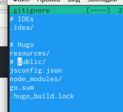{ #fig:012 width=70% }
	
		3) Снова привязываем репозиторий и нам это удаётся (рис. [-@fig:013])
	
		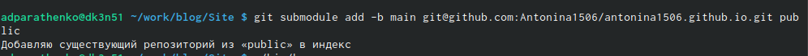{ #fig:013 width=70% }
		
	7) Вызываем hugo, чтобы скомпелировать файлы (рис. [-@fig:014])
		
	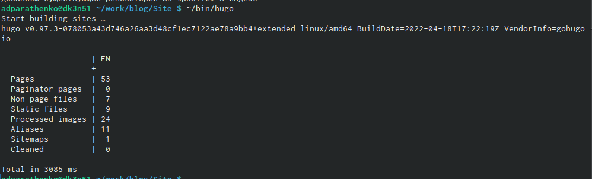{ #fig:014 width=70% }
		
	8) Загружаем всё на github (рис. [-@fig:015]) (рис. [-@fig:016])
		
	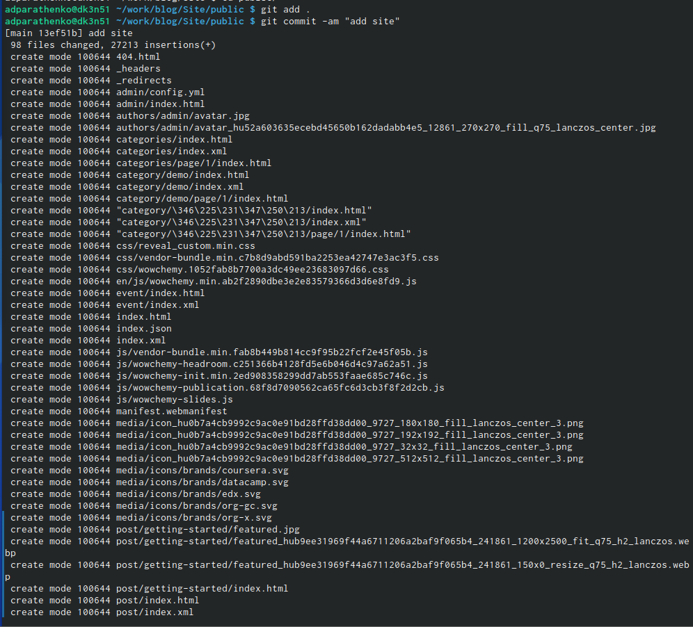{ #fig:015 width=70% }
		
	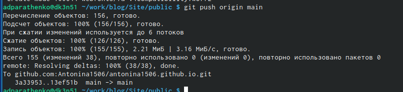{ #fig:016 width=70% }
		
	9) Проверяем выгрузку файлов на github (рис. [-@fig:017])
		
	{ #fig:017 width=70% }
		
10) Итоговый сайт (рис. [-@fig:018])
	
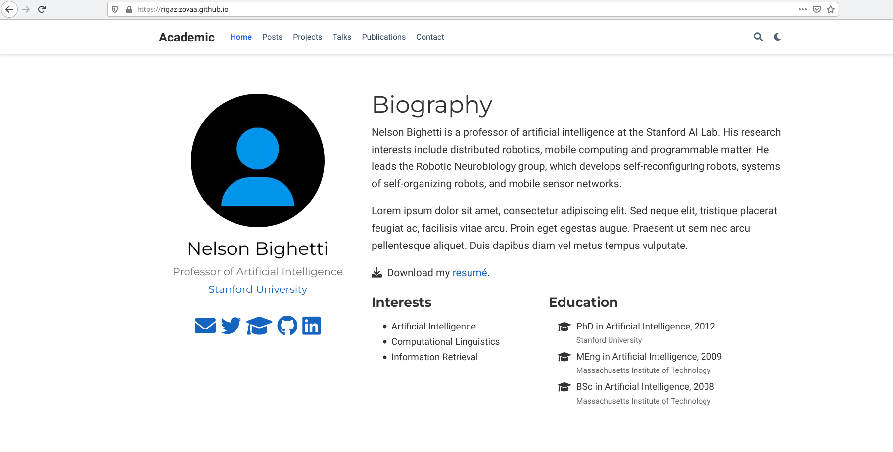{ #fig:018 width=70% }

# Выводы

Научились использовать шаблоны сайта с github и размещать на Github pages заготовки для персонального сайта.

