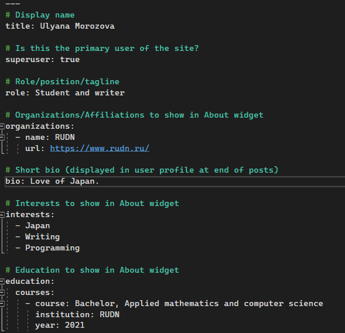
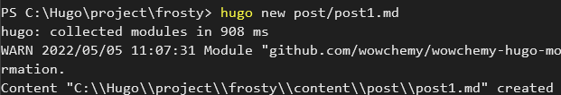
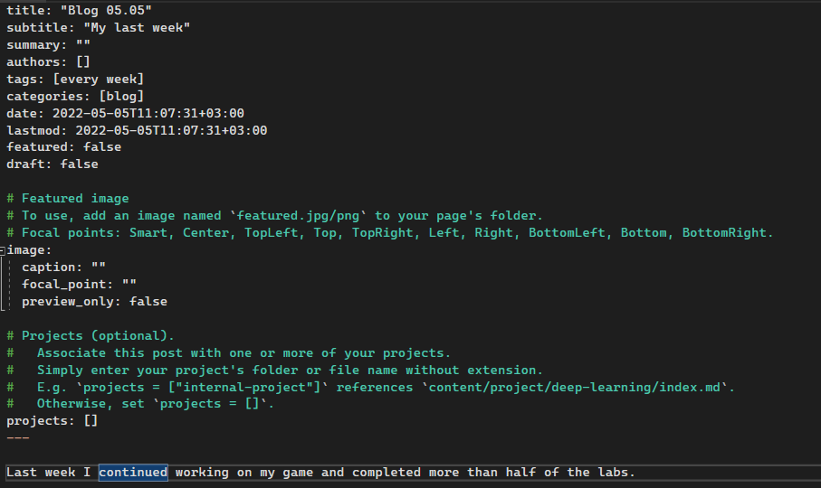

---
## Front matter
title: "Отчет к индивидуальному проекту (этап 2)"
subtitle: "Основы информационной безопасности"
author: "Газизова Регина"

## Generic otions
lang: ru-RU
toc-title: "Содержание"

## Bibliography
bibliography: bib/cite.bib
csl: pandoc/csl/gost-r-7-0-5-2008-numeric.csl

## Pdf output format
toc: true # Table of contents
toc-depth: 2
lof: true # List of figures
lot: true # List of tables
fontsize: 12pt
linestretch: 1.5
papersize: a4
documentclass: scrreprt
## I18n polyglossia
polyglossia-lang:
  name: russian
  options:
	- spelling=modern
	- babelshorthands=true
polyglossia-otherlangs:
  name: english
## I18n babel
babel-lang: russian
babel-otherlangs: english
## Fonts
mainfont: PT Serif
romanfont: PT Serif
sansfont: PT Sans
monofont: PT Mono
mainfontoptions: Ligatures=TeX
romanfontoptions: Ligatures=TeX
sansfontoptions: Ligatures=TeX,Scale=MatchLowercase
monofontoptions: Scale=MatchLowercase,Scale=0.9
## Biblatex
biblatex: true
biblio-style: "gost-numeric"
biblatexoptions:
  - parentracker=true
  - backend=biber
  - hyperref=auto
  - language=auto
  - autolang=other*
  - citestyle=gost-numeric
## Pandoc-crossref LaTeX customization
figureTitle: "Рис."
tableTitle: "Таблица"
listingTitle: "Листинг"
lofTitle: "Список иллюстраций"
lotTitle: "Список таблиц"
lolTitle: "Листинги"
## Misc options
indent: true
header-includes:
  - \usepackage{indentfirst}
  - \usepackage{float} # keep figures where there are in the text
  - \floatplacement{figure}{H} # keep figures where there are in the text
---

# Задание

Добавить к сайту данные о себе.

1. Список добавляемых данных.
  - Разместить фотографию владельца сайта.
  - Разместить краткое описание владельца сайта (Biography).
  - Добавить информацию об интересах (Interests).
  - Добавить информацию от образовании (Education).
  - Сделать пост по прошедшей неделе.
2. Добавить пост на тему по выбору:
  - Управление версиями. Git.
  - Непрерывная интеграция и непрерывное развертывание (CI/CD).

# Выполнение индивидуального проекта

1. Я разместила свой аватар на сайт. Для этого я поменяла исходное изображение в папке content/authors/admin avatar.jpg на свою фотографию (рис.1). Загрузила на GitHub, и Netlify автоматически построил мой сайт.
Чтобы поменять информацию о владельце сайта, я открыла файл _index.md, который находится в той же папке, что и фотография (рис.2-3), и изменила его содержимое. В частности поменяла имя, образование и интересы. Самое важное, чтобы вводимая информация была также на английском языке. 
Результат моих изменений вы можете увидеть на рисунке 4.

{ #fig:001 width=70% }

{ #fig:001 width=70% }

{ #fig:001 width=70% }

{ #fig:001 width=70% }

2. Затем я сделала пост по прошедшей неделе. Для этого в командную строку ввела команду hugo new post/post1.md с указанием пути, куда должен создаться файл (рис.5). Открыла созданный файл и отредактировала его (рис.6): изменила название поста, добавила тег и категорию, написала о прошедшей неделе.

{ #fig:001 width=70% }

{ #fig:001 width=70% }

Отправила изменения на GitHub и, подождав, пока Netlify изменит мой сайт, открыла созданный мною пост (рис.7).

{ #fig:001 width=70% }

3. Следующим пунктом нужно было создать пост на одну из предложенных тем. Я выбрала первую тему: "Git. Управление версиями", и проделала те же действия, что и при создания первого поста (рис.8-9)

{ #fig:001 width=70% }

{ #fig:001 width=70% }

# Выводы

Я отредактировала информацию о себе на сайте, научилась создавать посты и опубликовывать их.

::: {#refs}
:::
