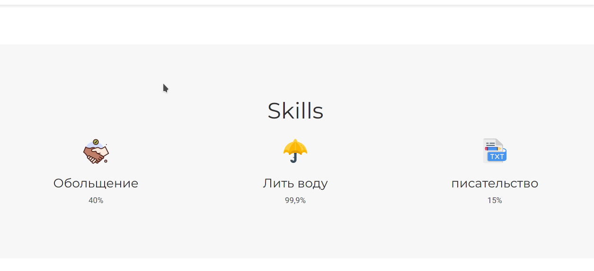
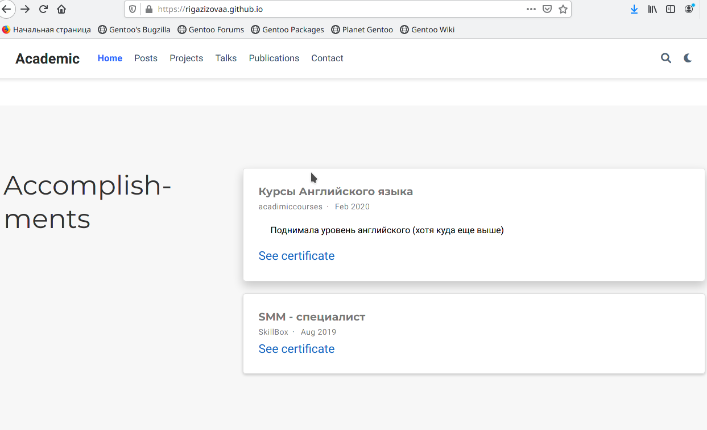
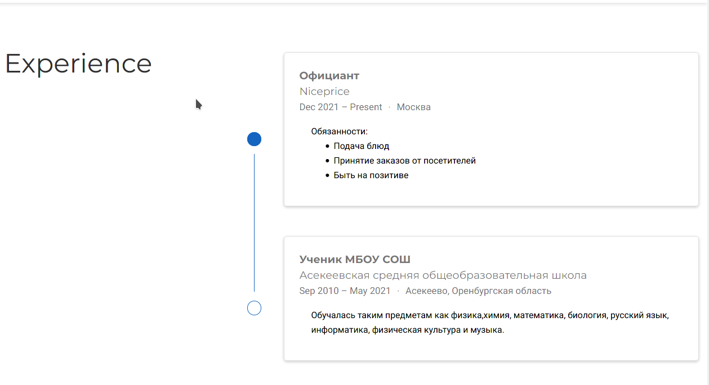
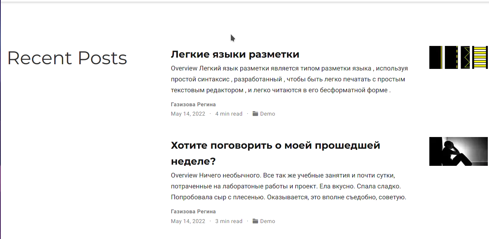

---
## Front matter
lang: ru-RU
title: Отчет по 3 этапу проекта
author: |
	
	Газизова Регина\inst{4}
institute: |
	\inst{1}RUDN University, Moscow, Russian Federation
	
date: 14 мая 2022, Москва, Россия
## Formatting
toc: false
slide_level: 2
theme: metropolis
header-includes: 
 - \metroset{progressbar=frametitle,sectionpage=progressbar,numbering=fraction}
 - '\makeatletter'
 - '\beamer@ignorenonframefalse'
 - '\makeatother'
aspectratio: 43
section-titles: true
---

# Третий эта индивидульного проекта

## Навыки

- ТЗаполнили информацию о навыках.

{ #fig:001 width=70% }

## Достижения

- Добавили информацию о достижениях.

{ #fig:003 width=70% }

## Опыт

- Добавили информацию об опыте.

{ #fig:002 width=70% }

## Посты

Создали 2 поста

{ #fig:004 width=70% }

## {.standout}

That's all
