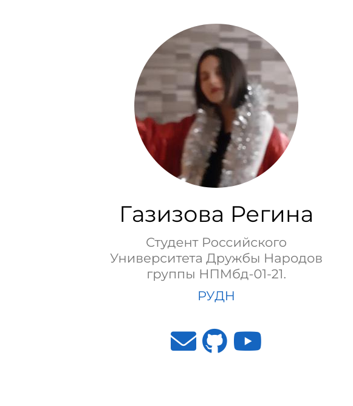
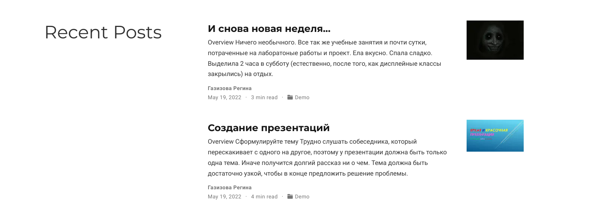
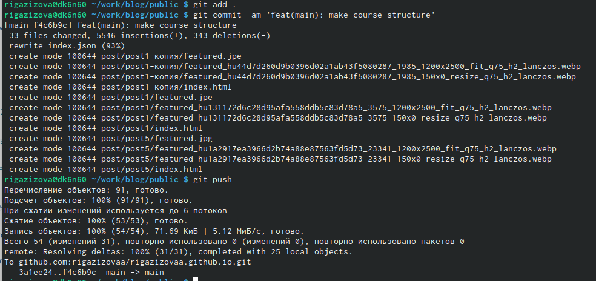

---
## Front matter
lang: ru-RU
title: 4 этап идивидуального проекта
author: |
	 Газизова Регина\inst{4}
institute: |
	\inst{1}RUDN University, Moscow, Russian Federation
	
date: 19 мая 2022, Москва, Россия
## Formatting
toc: false
slide_level: 2
theme: metropolis
header-includes: 
 - \metroset{progressbar=frametitle,sectionpage=progressbar,numbering=fraction}
 - '\makeatletter'
 - '\beamer@ignorenonframefalse'
 - '\makeatother'
aspectratio: 43
section-titles: true
---

# 4 этап Индивидуального проекта

## Ссылки на научные и библиометрические ресурсы.

 Прикрепили ссылки на различные аккаунты.

{ #fig:001 width=70% }

## Посты

 Создали 2 поста.
 
 { #fig:002 width=70% }

## Залили на сайт

 { #fig:003 width=70% }

## {.standout}

The end.
