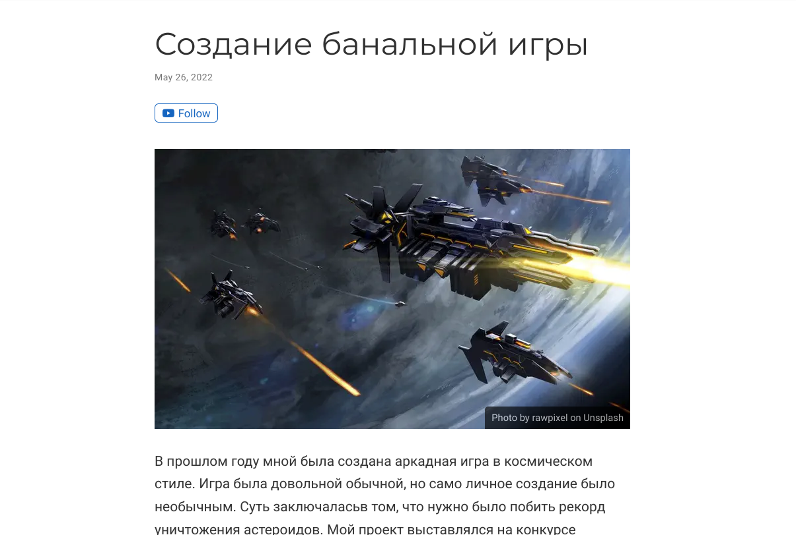
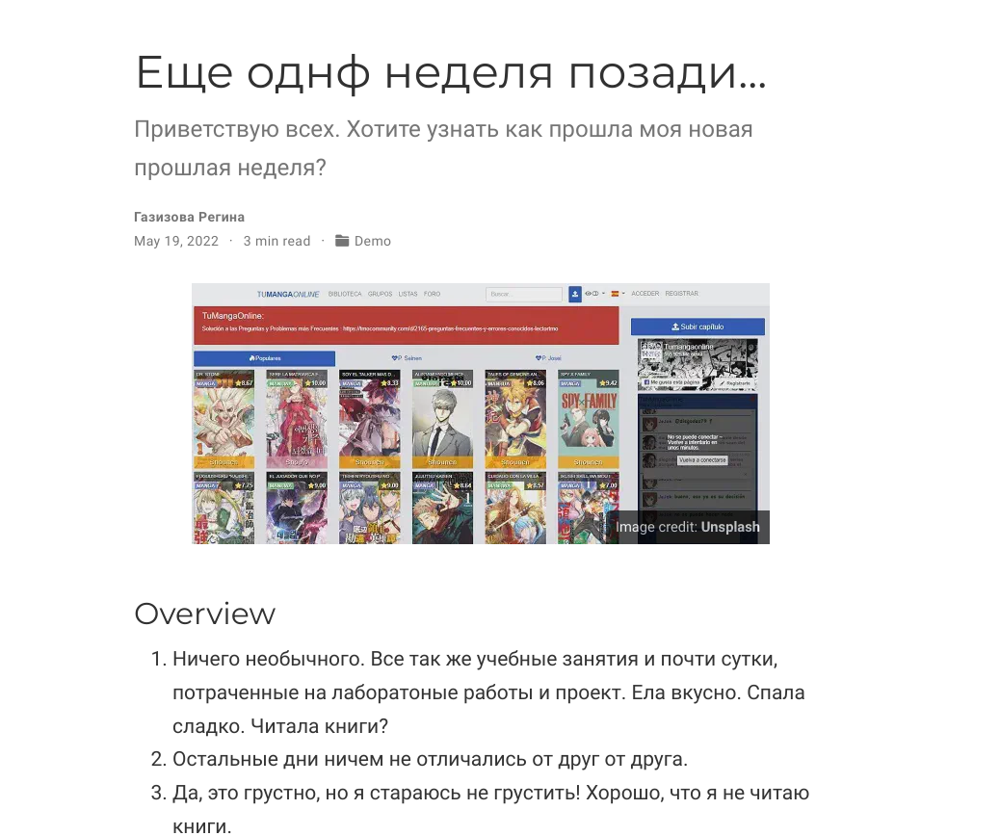
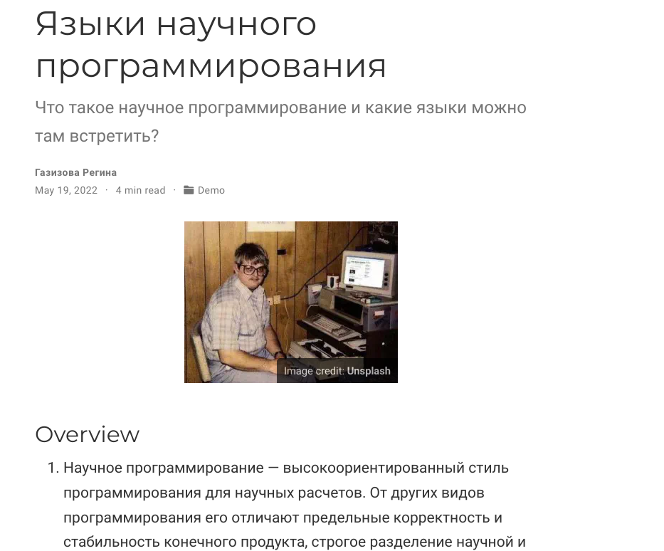

---
## Front matter
lang: ru-RU
title: 5 этап ИП
author: |
	Газизова Регина\inst{4}
institute: |
	\inst{1}RUDN University, Moscow, Russian Federation
	
date: 26 мая 2022, Москва, Россия

## Formatting
toc: false
slide_level: 2
theme: metropolis
header-includes: 
 - \metroset{progressbar=frametitle,sectionpage=progressbar,numbering=fraction}
 - '\makeatletter'
 - '\beamer@ignorenonframefalse'
 - '\makeatother'
aspectratio: 43
section-titles: true
---

# 5 этап проекта

## Проектная деятельность

Сделала запись персонального проекта

{ #fig:001 width=70% }

## Пост о неделе

Сделала пост о прошедшей неделе

{ #fig:002 width=70% }

## пост на тему

Сделала пост на тему

{ #fig:003 width=70% }

## {.standout}

Спасибо за внимание!!
